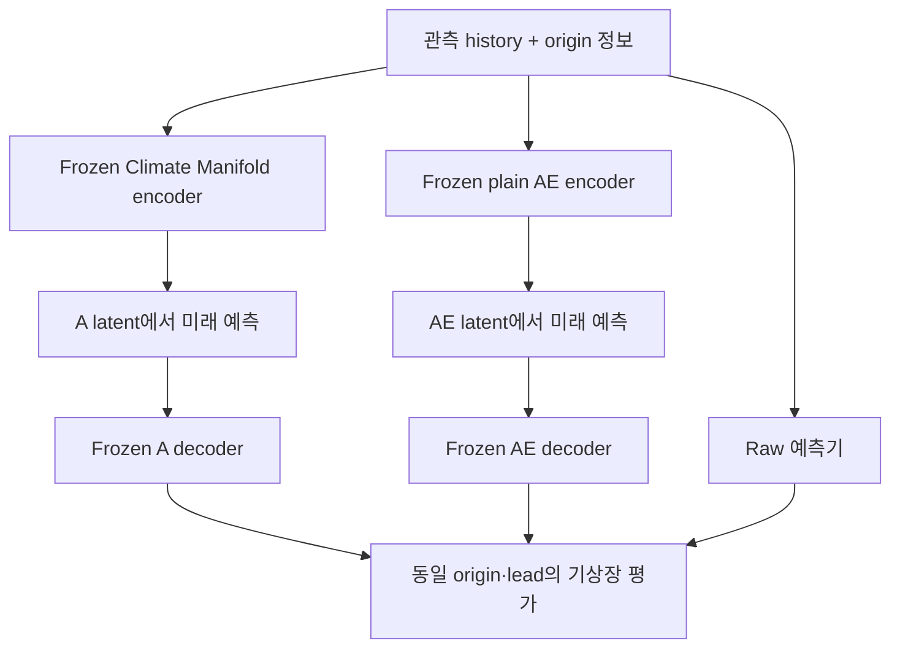

# Climate Manifold 공간에서의 예측 실험

주실험은 **frozen encoder → latent 예측기 → frozen decoder**입니다.
A가 학습한 표현 안에서 미래 동역학을 학습할 수 있는지 확인합니다.
A의 기존 기압·지위고도 분포 손실, 지형 L2, PINN 학습은 그대로 유지하며,
Hydra B/C는 이 실험에 포함하지 않습니다.

## 주실험: 세 가지 표현 비교

| 비교군 | 예측 경로 | 역할 |
|---|---|---|
| Raw | `history → MLP/Neural ODE → future fields` | 원본 공간 기준선 |
| **Climate Manifold** | `history → frozen A encoder → latent MLP/Neural ODE → frozen A decoder` | **물리·정보 제약으로 학습한 표현의 예측 유용성** |
| Plain AE | `history → frozen AE encoder → latent MLP/Neural ODE → frozen AE decoder` | 같은 차원·encoder 폭의 재구성 전용 압축 기준선 |

기본으로 MLP와 Neural ODE 각각 세 비교군을 실행합니다. 즉 seed당 6개 예측기를
학습합니다. Plain AE는 A에서 가중치를 복사하지 않고 **새로 학습**하며,
예측기 학습 전에 한 번 학습한 AE를 모든 예측기 계열·seed에서 고정해서 사용합니다.
즉 A와 AE 모두 하나의 고정 표현을 비교합니다. Raw persistence도 별도로 평가할 수 있습니다.



`ManifoldBridge`가 정규화·인코딩·디코딩 계약을 연결합니다. A의 경우
`history [B,H,D]`를 A의 train 통계로 표준화한 `q [B,H,64]`로 바꿉니다.
64는 전체 기후장을 압축한 벡터 차원이며 격자당 채널 수가 아닙니다.
예측기는 이 latent history에서 미래 latent를 생성하고, decoder가 기상장으로 복원합니다.

Encoder와 decoder의 parameter는 고정합니다. **Decoder의 연산 그래프는 유지**하므로
복원 기상장의 손실이 latent 예측기로 역전파됩니다. 후단 loss는 기상장 MSE와
시간 변화량 오차이며, 미래 latent를 예측 입력으로 제공하지 않습니다.
Latent 모델에는 원본 기후장이나 origin 정보를 직접 전달하는 우회 경로가 없습니다.
정보는 encoder를 통해서만 들어갑니다.

주실험 `--experiment primary`에서는 `--anchor none`을 강제합니다.
따라서 출력은 순수하게 `D(predicted_latent)`이며, 관측 origin의 복원 잔차를
더해 압축 오차를 우회하지 않습니다. 단, decoder의 상 위에 출력된다는 사실만으로
엄밀한 smooth manifold나 물리적으로 타당한 trajectory가 보장되는 것은 아닙니다.

## 데이터·학습 조건

- 모든 비교군은 같은 A checkpoint에서 정한 surface archive, 정보 파일, 정규화,
  시간 분할과 예측 horizon을 사용합니다.
- A는 기존 `train`으로 학습하고 `expert_validation`으로 선택합니다.
  Plain AE도 `train / expert_validation`을 사용하되 **재구성 손실만** 학습합니다.
  후단 예측기는 `train`으로 학습하고 **`calibration`에서 checkpoint를 선택**합니다.
  개발 평가는 `validation`, 확정 후 최종 평가는 `test`입니다.
- 과거 history 전체를 인코딩할 때 **origin 시점 정보**만 사용합니다.
  미래 surface는 감독·평가 label이며 미래 정보 필드는 읽지 않습니다.
- Raw NN은 기본적으로 같은 origin 정보를 직접 condition으로 받습니다.
  A와 Plain AE 경로는 이 정보를 encoder를 통해서만 전달합니다.
  `--no-information-conditioning`은 raw NN의 직접 정보 condition을 제거하는 별도 ablation이며,
  enriched A에서는 `--experiment auxiliary`로만 실행할 수 있습니다.
- 후단 hidden width·학습 예산·초기시각·lead·학습 창을 맞춥니다. Raw와 latent는
  입력 차원 때문에 같은 hidden width에서도 parameter 수가 다릅니다.
- **A와 Plain AE의 사전학습 목적·학습 예산은 동일하지 않습니다.** 보고서의 사전학습
  설정과 비용을 함께 제시해야 합니다. 이 비교는 복합적인 A 표현의 유용성을 검증하며,
  PINN 하나의 인과적 효과를 분리하지는 않습니다. 이를 위해서는 A의 별도 loss ablation이 필요합니다.
- 기본 3개 forecast seed는 같은 A와 같은 Plain AE를 공유하며 예측기의 초기화·학습 순서만 바꿉니다.
  표현의 사전학습 변동성까지 추정하려면 A와 AE 모두 seed별로 학습한 별도 실험이 필요합니다.

비교기는 A·데이터 checksum, 초기시각, lead와 실험 종류를 검사합니다.
같은 모델 계열에서 학습 조건이 다른 보고서를 합치지 않으며, 실패한 origin 집합이
다르면 동일 사례에 대한 순위를 매길 수 없도록 표시합니다.
주실험과 보조 실험의 보고서를 같은 비교표에 섞으면 거부합니다.

## 주실험 실행

```bash
python -m pip install -e '.[test,era5]'
export A_CHECKPOINT=/absolute/path/to/manifold.pt
export ARCHIVE=/absolute/path/to/surface.npz
export INFO=/absolute/path/to/information_pinn_shards

# 2 predictor families × 3 representations × 3 seeds
export RUN=runs/latent_comparison_001
export DEVICE=cuda EPOCHS=20 AE_EPOCHS=20 BATCH_SIZE=2 SEEDS='7 19 43'
bash scripts/run_model_comparison.sh
```

주실험에는 ClimODE 상수 파일이 필요하지 않습니다. `surface` A라면 `INFO`를
unset합니다. `RUN`은 새 디렉터리여야 하며 `MODELS='neural_ode'`로 한 계열만
실행할 수 있습니다. `MODELS=climode`나 `ANCHOR=origin`은 주실험에서 거부합니다.

주요 환경 변수:

| 변수 | 기본값·역할 |
|---|---|
| `MODELS` | `mlp neural_ode` |
| `EPOCHS / AE_EPOCHS` | 후단 / Plain AE 사전학습 각각 20 |
| `AE_SEED` | AE 사전학습 seed 7; 학습한 하나의 AE를 모든 forecast seed에 재사용 |
| `LEARNING_RATE / AE_LEARNING_RATE` | 각각 0.001 |
| `HIDDEN_DIM` | 후단 폭 128; AE latent 차원·encoder 폭은 A에 맞춤 |
| `HORIZON_STEPS` | 20, 기본 A에서 6h × 20 = 120h |
| `WINDOW_STRIDE / MAX_WINDOWS` | 4 / 0(모든 학습·선택 창) |
| `ORIGIN_STRIDE / MAX_CASES` | 1 / 0(모든 평가 origin) |
| `AE_CHECKPOINT` | 생략하면 새 AE 하나 학습. 지정하면 같은 A 데이터 계약의 기존 AE 재사용 |

기본 AE는 `RUN/plain-ae.pt`에 저장합니다. `SEEDS`의 변동은 A/AE 재학습 변동을
포함하지 않습니다. 학습 재개는 지원하지 않으며 완료한 checkpoint는 재평가할 수 있습니다.

Climate Manifold → Neural ODE 한 모델만 실행하려면:

```bash
train-manifold-predictor --a-checkpoint "$A_CHECKPOINT" --archive "$ARCHIVE" \
  --information "$INFO" --experiment primary --representation climate_manifold \
  --model neural_ode --bridge latent --anchor none \
  --output runs/neural_ode_manifold.pt --epochs 20 --horizon-steps 20 --device cuda

evaluate-manifold-predictor --checkpoint runs/neural_ode_manifold.pt \
  --archive "$ARCHIVE" --information "$INFO" --split validation \
  --output runs/neural_ode_manifold.validation.json \
  --forecast-output runs/neural_ode_manifold.forecast.npz --device cuda
```

Plain AE만 먼저 학습하고 연결하려면:

```bash
python -m climate_manifold.downstream.plain_ae \
  --a-checkpoint "$A_CHECKPOINT" --archive "$ARCHIVE" --information "$INFO" \
  --output runs/plain_ae.pt --epochs 20 --device cuda

train-manifold-predictor --a-checkpoint "$A_CHECKPOINT" --archive "$ARCHIVE" \
  --information "$INFO" --experiment primary --representation plain_ae \
  --ae-checkpoint runs/plain_ae.pt --model neural_ode --bridge latent \
  --output runs/neural_ode_plain_ae.pt --epochs 20 --device cuda
```

Raw 기준선은 `--model neural_ode --bridge raw`를 사용합니다. Persistence는
`--model persistence --bridge raw`이며 학습 parameter가 없고 같은 데이터 계약의
checkpoint를 저장합니다. 후단 checkpoint에는 고정된 표현의 가중치와 통계가
포함되어 원본 A/AE 경로 없이 재평가할 수 있습니다. 데이터 checksum은 일치해야 합니다.

## 평가와 latent 진단

**모델 간 우열은 같은 물리 단위의 기상장 점수로 비교**합니다.

| 질문 | 지표·판독 |
|---|---|
| 기상장을 더 잘 예측하는가? | 변수별·6h lead별 면적 가중 RMSE/MAE/bias, 전체 pooled RMSE |
| Persistence보다 나은가? | `1 − RMSE_model / RMSE_persistence`; 양수면 개선 |
| anomaly 패턴을 유지하는가? | ACC; train의 격자별 고정 평균 기준, 계절 climatology와 구분 |
| 첫 lead 이후 정체하는가? | 시간당 tendency RMSE, predicted/true tendency RMS 비율 |
| 대규모 평균·바람은 맞는가? | field-mean RMSE, U10/V10으로 계산한 풍속 RMSE |
| 안정적인가? | 전체 rollout 유한 예측 비율, 실패 origin 목록 |
| 비용은 얼마인가? | trainable/total parameter, 학습·추론 시간, CUDA peak memory |

Latent 예측 실험에는 별도 `latent_diagnostics`가 추가됩니다. **먼저 예측을 완료한 후**
실제 미래 기후장을 같은 encoder와 같은 origin 정보로 인코딩하여 진단용 목표를
만듭니다. 이것은 사후 평가이며 예측 입력이나 미래 정보 condition이 아닙니다.

| 진단 필드 | 의미 |
|---|---|
| `latent_rmse`, `latent_persistence_rmse` | 예측 latent 오차와 마지막 latent 유지 기준선 |
| `latent_tendency_rmse_per_hour`, `latent_tendency_amplitude_ratio` | latent 변화량 정확도와 정체 여부 |
| `latent_cycle_rmse` | 예측 latent를 decode→encode했을 때의 좌표 차이 |
| `future_reconstruction_normalized_rmse` | 실제 미래를 encode→decode한 재구성 오차; 예측 점수 아님 |
| `projected_persistence_normalized_rmse` | origin 복원장을 유지한 기상장 오차 |
| `forecast_vs_reconstructed_target_normalized_rmse` | 예측장과 미래 재구성장 사이 오차 |

A와 Plain AE는 **서로 다른 좌표계**를 학습하므로 latent RMSE 값으로 두 표현의
우열을 직접 매기지 않습니다. 미래 재구성 오차도 수학적으로 증명된 예측 오차의
하한이 아닙니다. 실제 truth에 대한 예측 오차와 함께 표현 손실·동역학 손실을
살펴보는 진단입니다. 물리 잔차 평가가 이 진단에 자동으로 포함되지는 않습니다.

출력은 모델별 `.validation.json`, 첫 성공 origin의 `.forecast.npz`,
그리고 `comparison.json/.csv`입니다. Latent 실험의 NPZ에는 물리 단위 예측·truth와
`predicted_latent`, `origin_latent`, `diagnostic_target_latent`도 포함됩니다.
추론 시간에는 미래 재구성 audit를 제외하고, 전체 평가 시간은 별도로 기록합니다.
`paired_effects / paired_summary`는 같은 모델·forecast seed에서 raw 및 Plain AE 대비
Climate Manifold의 RMSE 감소량을 집계합니다. 양수면 Climate Manifold가 더 정확합니다.

시간 변화량의 첫 전이는 관측 origin에서 첫 예측으로 계산하므로 재구성 오차도
포함합니다. RMSE는 사례별 RMSE 평균이 아니라 제곱 오차를 모은 뒤 제곱근을 취합니다.
현재 MLP/Neural ODE는 결정론적이며 Hydra의 ensemble 경로 보정 성능을 평가하지 않습니다.

## 보조 실험: ClimODE

ClimODE는 공간 격자에서 미분하는 모델입니다. 64차원 전역 latent를 격자로
reshape해서 넣을 수 없으므로 `latent + climode`는 거부합니다.
ClimODE 비교는 아래 두 가지를 **별도 auxiliary 실험**으로 유지합니다.

| 비교군 | 경로 |
|---|---|
| Raw ClimODE | `history grid → ClimODE → future fields` |
| Decoded ClimODE | `history → A encoder → A decoder → reconstructed grid → ClimODE` |

두 번째 경로는 manifold 내의 예측이 아니라 복원된 입력 격자의 효과를 보는 실험입니다.
ClimODE 출력이 decoder의 상에 머무른다는 보장은 없습니다.
Enriched A는 상층 정보도 전달하므로 raw ClimODE와의 차이는 표현과 추가 정보의 결합 효과입니다.

```bash
python -m pip install -e '.[forecast]'
python scripts/prepare_climode_constants.py --archive "$ARCHIVE" \
  --fields /absolute/path/to/constants.nc --output data/climode_constants.npz
export CONSTANTS="$PWD/data/climode_constants.npz"
export RUN=runs/auxiliary_climode_001
bash scripts/run_climode_comparison.sh
```

직접 실행할 때는 `--experiment auxiliary --model climode --bridge raw|decoded
--constants "$CONSTANTS"`를 사용합니다. 실제 정렬된 orography와 육해 마스크가
필요하며 가짜 상수로 대체하지 않습니다. 기본 attention은 최소 15×15 격자가 필요합니다.

공식 [Aalto-QuML/ClimODE](https://github.com/Aalto-QuML/ClimODE) commit
`e729d23e8799ce0e075699e76d60227d848d8d0c`의 residual CNN, attention,
transport PDE, Gaussian head를 포함합니다.
[MIT 라이선스·인용·수정 내역](../THIRD_PARTY_NOTICES.md)을 보존합니다.
이 구현은 **ClimODE custom-data adaptation**이며 논문 점수의 재현이 아닙니다.

| 항목 | 수정·제약 |
|---|---|
| 변수 | 원본 Z500/T850/T2m/U10/V10 대신 A의 msl/t2m/u10/v10, 채널 폭 일반화 |
| 정규화 | A의 train-only 격자별 mean/std 사용; 원본 min/max와 다름 |
| 초기 transport velocity | 관측 마지막 2장의 backward tendency로 Adam/ridge 적합; 미래 미사용 |
| 시간·적분 | 내부 0.01×physical hours, 기본 1h Euler, 6h 출력; error head clock 정합 |
| Dropout/BatchNorm | ODE RHS를 결정론적으로 유지하기 위해 eval 고정, 가중치·affine는 학습 |
| 시간 feature | 원본 식 유지; 계절 feature가 %24 이후 계산되는 원본 제약도 유지 |
| 학습 | rollout Gaussian NLL + tendency, 선택은 공통 state MSE; 원본 variance penalty 미사용 |

Transport velocity는 변수별 보존식의 보조 상태이며 관측 U10/V10 자체가 아닙니다.
ClimODE에는 Gaussian CRPS/NLL, 80% coverage, spread–skill도 계산합니다.
이 head는 지점·lead별 주변분포이며 coherent trajectory ensemble을 보장하지 않습니다.

## 소프트웨어 검증

다단계 A 보강 후 통합 검증에서 **110개 테스트가 통과**했고 새 A로 6개 후단 조합을
재검증했습니다. 기존 통합 검증에서는 주실험 6개 조합과
별도로 분리된 ClimODE 보조 실험 2개 조합 모두 **20 lead(120h) × 2 origin**의
합성 평가를 완료했습니다. 4개 latent 실험의 사후 진단과 동일 seed의 paired 비교도 확인했습니다.

```bash
python -m pytest -q
python scripts/smoke_downstream.py --output runs/downstream_smoke_001
# 선택적으로 분리된 ClimODE 보조 경로도 검증
python scripts/smoke_downstream.py --output runs/downstream_smoke_002 --with-climode
```

기본 smoke는 A64/hidden512 합성 checkpoint를 만들고 재구성 전용 AE를 1 epoch
학습한 후, 6개 주실험 조합의 학습·저장·reload·20 lead(120h) 평가를 실행합니다.
`--a-smoke-dir runs/smoke-a64`로 기존 A smoke를 재사용할 수 있습니다.
`--without-climode`는 기본 동작과 같은 호환 옵션입니다.
ClimODE 추가 smoke만 4×8 격자의 attention을 끄고 6h Euler·velocity fit 2 steps를
사용하며 별도 비교 파일에 저장합니다. 테스트는 frozen 표현, decoder gradient,
미래 정보 차단, 진단 수식 및 비교 계약을 확인합니다.
**합성 결과는 소프트웨어 검증이며 실제 ERA5 예측 우월성의 근거가 아닙니다.**
