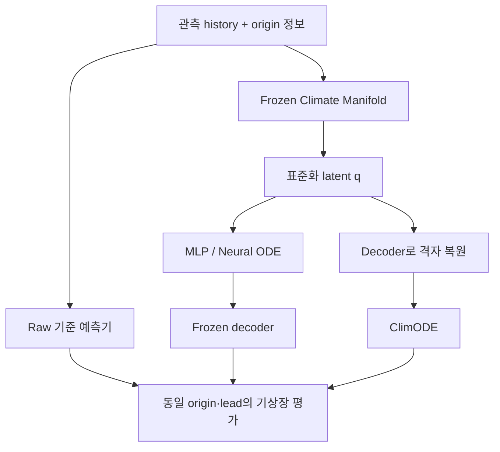

# Climate Manifold → 예측 모델 비교

A가 학습한 표현을 고정하고 **같은 예측기 계열에서 raw 입력과 manifold 입력의
성능을 비교**하는 실험입니다. Hydra B/C와는 독립된 후단 모듈입니다.
A의 기존 기압·지위고도 분포 손실, 지형 L2, PINN 코드는 수정하지 않았습니다.
먼저 기존 명령으로 A를 학습한 뒤, 여기서는 **A 전체를 frozen/eval 상태로 유지**합니다.

## 연결 방식

| 모델 | 원본 입력 기준선 | Climate Manifold 연결 |
|---|---|---|
| Recurrent MLP | `history → MLP → field` | `history → A.encode → latent MLP → A.decode → field` |
| Neural ODE | `history → field-space RK4 ODE → field` | `history → A.encode → latent RK4 ODE → A.decode → field` |
| ClimODE adapted | `history grid → ClimODE → field` | `history → A.encode → A.decode → reconstructed grid → ClimODE → field` |
| Persistence | 마지막 관측장 반복 | 선택적으로 마지막 manifold 복원장 반복 |



`ManifoldBridge`가 중간 연결 모듈입니다. 입력은 A checkpoint 통계로 정규화한
`history [B,H,D]`와 **origin 시점 정보**입니다. `latent` 모드는 A의 train 통계로
표준화된 `q [B,H,64]`, `decoded` 모드는 복원된 `[B,H,D]`를 반환합니다.
`q`를 격자로 reshape하지 않습니다. Decoder 가중치는 고정하지만, decoder를 통한
후단 latent 예측기의 gradient는 유지합니다.

ClimODE의 상태 미분에는 실제 공간 격자가 필요합니다. 따라서 `latent + climode`
조합은 거부합니다. `decoded + climode`는 manifold를 **입력 표현·복원 단계**로 쓰는
실험이며 이후 ClimODE 경로가 decoder manifold 위에 머무른다는 보장은 없습니다.

기본 `--anchor none`은 decoder 복원 오차까지 end-to-end 성능에 포함합니다.
`--anchor origin`은 모든 예측에 `observed_origin - decoded_origin`을 더합니다.
후자는 초기 잔차를 보존하는 별도 ablation으로 보고하고 순수 압축 표현과 구분하세요.
구성마다 origin reconstruction RMSE도 출력합니다.

## 데이터와 비교의 공정성

- 모든 실험은 같은 A checkpoint, surface archive, 정보 파일, 정규화 및 시간 분할을 사용합니다.
- A 학습은 기존 `train`, A 선택은 `expert_validation`입니다. 후단 학습은 `train`,
  후단 checkpoint 선택은 **기존에 사용하지 않았던 `calibration`**, 최종 개발 평가는
  `validation`입니다. `test`는 설정을 확정한 후 별도로 실행합니다.
- 미래 surface는 감독 label에만 사용합니다. 데이터 로더는 미래 정보 필드를 읽지 않습니다.
  과거 각 시점을 인코딩할 때 쓰는 origin 정보는 A의 기존 계약을 따릅니다.
- MLP/Neural ODE의 raw 기준선은 기본적으로 **A에 제공한 것과 같은 origin 정보**를
  직접 condition으로 받습니다. latent/decoded 쪽에서는 이 정보가 **A를 통해서만**
  전달되며 후단으로 우회 입력되지 않습니다. 정보 접근량을 맞추면서 압축 표현의 효과를
  비교하는 구성입니다. `--no-information-conditioning`은 raw 기준선의 직접 condition을
  제거하는 추가 ablation이며 enriched A 안의 정보까지 제거하지는 않습니다.
- ClimODE raw는 지상장과 정적 상수만 직접 받습니다. enriched A→decoded ClimODE에는
  A를 통해 상층 정보도 전달됩니다. 이 비교는 **표현과 추가 정보의 결합 효과**입니다.
  순수 manifold 효과를 분리하려면 surface-only A를 사용한 대응 실험도 필요합니다.
- 같은 hidden width라도 raw/latent 차원 때문에 학습 parameter 수는 다릅니다.
  보고서의 trainable/total parameter 수와 학습·추론 시간을 함께 제시하세요.
- 비교기는 origin, lead, 데이터·A checksum을 검사합니다. 같은 모델 계열 안에서
  학습 표본·학습 설정·정적 상수·예측기 설정이 다른 보고서는 합치지 않습니다.

## 실제 ClimODE 원본과의 관계

공식 저장소 [Aalto-QuML/ClimODE](https://github.com/Aalto-QuML/ClimODE)의 commit
`e729d23e8799ce0e075699e76d60227d848d8d0c` 모델을 포함합니다.
원본 residual CNN, attention, transport PDE, Gaussian mean/std head를 사용합니다.
MIT 라이선스와 원 논문 인용은 [THIRD_PARTY_NOTICES.md](../THIRD_PARTY_NOTICES.md)에 있습니다.

이 구현의 실험명은 **ClimODE custom-data adaptation**입니다. 다음 변경 때문에
논문의 WeatherBench 점수를 재현한 구현이라고 주장하지 않습니다.

| 항목 | 이번 연결 구현 |
|---|---|
| 변수·격자 | 원본 `Z500,T850,T2m,U10,V10` 대신 A의 `msl,t2m,u10,v10`; 입력·출력 채널 폭 일반화 |
| 정규화 | 모든 모델이 A의 train-only, 격자별 mean/std 사용; 원본 min/max 전처리와 다름 |
| 초기 transport velocity | 마지막 관측 2장의 backward tendency만으로 적합; 원본 cubic spline + dense kernel 대신 Adam/ridge |
| 시간 | ODE 내부 `0.01 × physical hours`; 초기 velocity fit과 error head도 이 물리 시간에 정합 |
| 적분 | Euler, 기본 내부 1h; 출력은 6h 간격. `--climode-step-hours`를 명시적으로 변경 가능 |
| Dropout/BatchNorm | ODE RHS가 매 호출 바뀌지 않도록 eval 고정; CNN 가중치·affine parameter는 학습 |
| 시간 임베딩 | 원본 `pde`/noise head의 일주기 및 계절 feature 식 유지. 원본 계절 feature가 `%24` 이후 계산되는 제약도 남음 |
| 오차 head 출력 | 원본 forward의 출력 slicing/clock 처리를 wrapper에서 명시적으로 처리 |
| 학습 | 전체 rollout Gaussian NLL + tendency loss, 공통 selection state MSE; 원본 variance penalty는 사용하지 않음 |

초기 transport velocity는 각 변수의 보존식에 맞춰 추정하는 보조 상태이며 관측
U10/V10을 그대로 velocity로 대입하지 않습니다. 위도·경도·육해 마스크·지형은 두
ClimODE 비교군에 동일하게 전달됩니다. **실제 육해 마스크를 0이나 가짜 데이터로
대체하지 않습니다.** 기본 attention은 최소 15×15 격자가 필요하며 소형 smoke만
`--no-climode-attention`으로 실행합니다.

## 실행

```bash
python -m pip install -e '.[test,era5,forecast]'
export A_CHECKPOINT=/absolute/path/to/manifold.pt
export ARCHIVE=/absolute/path/to/surface.npz
export INFO=/absolute/path/to/information_pinn_shards

# 실제 ERA5/WeatherBench constants 파일의 orography와 lsm을 A 격자에 정렬
python scripts/prepare_climode_constants.py --archive "$ARCHIVE" \
  --fields /absolute/path/to/constants.nc --output data/climode_constants.npz
export CONSTANTS="$PWD/data/climode_constants.npz"

# 세 모델 계열 × raw/manifold 두 방식 × 세 seed
export RUN=runs/model_comparison_001
export DEVICE=cuda EPOCHS=20 BATCH_SIZE=2 SEEDS='7 19 43'
bash scripts/run_model_comparison.sh
```

ClimODE 상수 파일이 준비되기 전에는 `MODELS='mlp neural_ode'`로 NN 비교부터 실행할
수 있습니다. `surface` A는 `INFO`를 unset합니다. `RUN`은 새 디렉터리여야 합니다.
학습 재개 기능은 없으며 완료한 checkpoint는 독립적으로 재평가할 수 있습니다.

한 가지 모델을 직접 학습·평가하려면:

```bash
train-manifold-predictor --a-checkpoint "$A_CHECKPOINT" --archive "$ARCHIVE" \
  --information "$INFO" --model neural_ode --bridge latent \
  --output runs/neural_ode_latent.pt --epochs 20 --horizon-steps 20 --device cuda

evaluate-manifold-predictor --checkpoint runs/neural_ode_latent.pt \
  --archive "$ARCHIVE" --information "$INFO" --split validation \
  --output runs/neural_ode_latent.validation.json --forecast-output runs/neural_ode_latent.npz \
  --device cuda
```

ClimODE는 `--model climode --bridge raw|decoded --constants "$CONSTANTS"`를 사용합니다.
NN 기준선은 `--model mlp --bridge raw`, persistence는 `--model persistence --bridge raw`
입니다. persistence에는 학습 parameter가 없고 학습 명령은 동일 데이터 계약의
checkpoint를 저장하는 역할을 합니다.

후단 checkpoint는 frozen A weights와 필요한 통계를 자체 포함합니다. 재평가 시
원본 A checkpoint 경로가 유지될 필요는 없습니다. 기존 데이터의 checksum은 일치해야 합니다.

## 평가 기준

| 질문 | 지표·판독 |
|---|---|
| 실제 기후장을 더 잘 예측하는가? | 변수별·6h lead별 면적 가중 RMSE/MAE/bias, 120h 전체 pooled RMSE |
| Persistence보다 나은가? | `1 − RMSE_model / RMSE_persistence`; 양수면 개선 |
| anomaly 패턴을 유지하는가? | ACC. **train의 격자별 고정 평균**을 뺀 anomaly; 계절별 climatology ACC와 구분 |
| 첫 lead 이후 정체하는가? | 시간당 tendency RMSE, predicted/true tendency RMS 비율. 0 근처면 움직임 부족 |
| 대규모 평균이 떠다니는가? | field-mean RMSE; 공간 오차와 함께 확인 |
| 바람 크기를 맞추는가? | U10/V10으로 계산한 풍속 RMSE(m/s) |
| 확률 폭과 보정은 적절한가? | ClimODE Gaussian CRPS/NLL, 80% coverage, spread/skill. 변수별 물리 단위로 계산 |
| 안정적인가? | 120h 전체 유한 예측 비율, 실패 origin 목록. 실패 사례를 숨기지 않음 |
| 비용은 얼마인가? | trainable/total parameter, 학습·추론 시간, CUDA peak memory |

NN/Neural ODE의 현재 출력은 결정론적이므로 확률 보정 점수를 부여하지 않습니다.
ClimODE의 Gaussian head도 **각 지점·lead의 주변분포**입니다. 독립적인 잡음을
뽑아 coherent trajectory ensemble이라고 주장하지 않습니다. 따라서 이 단계에서
Hydra의 joint ensemble 경로 보정 성능까지 검증하는 것은 아닙니다.

시간 변화량은 관측 origin과 예측 lead들을 이어서 계산합니다. `anchor none`의 첫
전이 오차에는 재구성 오차가 포함됩니다. RMSE는 사례별 RMSE의 평균이 아니라
**제곱 오차를 먼저 모은 뒤 제곱근**으로 계산합니다. 원본 truth나 미래 정보가
입력에 들어가는 oracle audit와 실제 forecast 지표를 혼합하지 않습니다.

최종 출력은 각 모델의 `.validation.json`, 첫 성공 origin의 물리 단위 `.forecast.npz`,
그리고 전체 `comparison.json/.csv`입니다. 3개 seed의 평균·표본 표준편차를 모으지만,
같은 A 하나를 고정한 비교이므로 A 재학습 변동성까지 추정한 것은 아닙니다.
실패 origin 집합이 다른 모델은 동일 사례에 대한 순위를 매길 수 없도록 표시합니다.

논문 근거는 **같은 설정에서 raw 대비 개선이 여러 lead·변수·seed에서 반복되는지**,
그리고 압축률·계산량·재구성 오차와 어떤 관계인지에서 확보합니다. 현재 제공하는
합성 smoke 수치는 예보 skill이나 Climate Manifold의 우월성 증거가 아닙니다.

## 소프트웨어 검증

통합 시점에 기존 A 테스트를 포함한 **80개 테스트가 통과**했습니다.
MLP·Neural ODE의 raw/latent와 ClimODE의 raw/decoded, 총 **6개 조합**에서
학습·checkpoint 재로딩·20 lead(120h) 합성 평가가 완료됐습니다. 검사는 frozen A의
불변성, decoder를 통한 gradient, 미래 정보 차단, 평가 수식 및 비교 조건도 포함합니다.
이 결과는 실행 경로의 검증이며 실제 ERA5 예측 성능은 아직 측정하지 않았습니다.

```bash
python -m pytest -q
python scripts/smoke_downstream.py --output runs/downstream_smoke_001
```

Smoke는 실제 A64/hidden512 synthetic checkpoint를 만든 후 6개 비교 조합의
1 epoch 학습·저장·reload·120h 평가를 실행합니다. 작은 4×8 격자 때문에 ClimODE
attention을 끄고 6h Euler 및 velocity fit 2 steps를 사용합니다. 별도 unit test에서
16×16 attention 경로도 확인합니다. 모든 real-data 실험은 별도로 수행해야 합니다.
