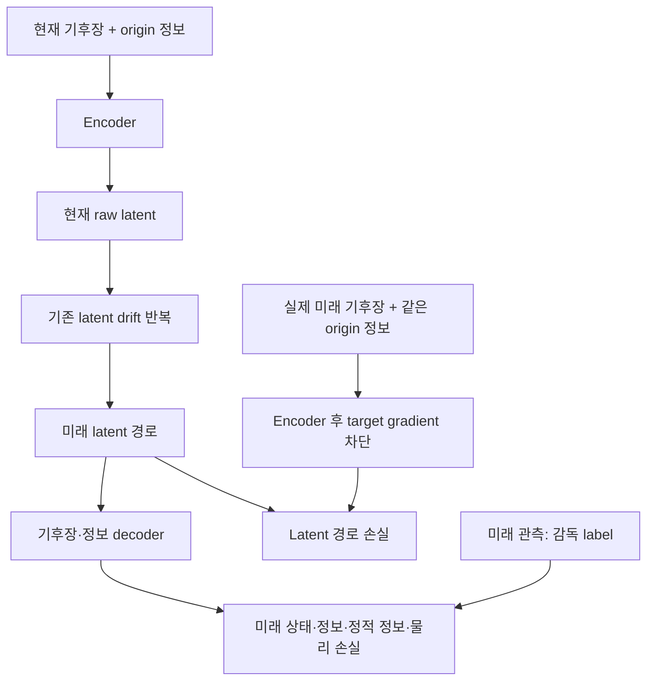

# A 자체의 미래 동역학 학습

이 구성은 **미래 예측에 유용한 latent 표현을 A 학습 중에 형성**하기 위한 보강입니다.
A의 encoder·decoder·기존 `latent_drift`·정보 decoder를 함께 학습합니다.
학습이 끝난 뒤 실행하는 후단 실험에서는 A를 고정하고 새 MLP/Neural ODE만 학습합니다.
Hydra B/C는 추가하지 않습니다.

## 두 경로를 맞추는 학습



기후장과 정보는 기존 train 통계로 정규화합니다. 이 학습 경로는 sealed 표준화 좌표 `q`가
아닌 A 내부의 **raw latent `z`**를 사용합니다. 기본 step은 실제 기상 시간 6시간이며,
drift의 단위가 하루당 변화량이므로 Euler 계수는 `dt_hours / 24`입니다.

\[
\hat z_0=E(x_t,I_t),\qquad
\hat z_{k+1}=\hat z_k+\frac{\Delta t_k}{24}\,g(\hat z_k),
\qquad
\hat x_k=D_x(\hat z_k),\quad \hat I_k=D_I(\hat z_k).
\]

각 예측 latent를 다음 step에 그대로 전달합니다. 중간에 실제 미래 latent를 넣는
teacher forcing과 `x_origin - D(E(x_origin,I_origin))` 잔차 보정은 사용하지 않습니다.
기존 drift를 재사용하므로 manifold 64차원·hidden 512 설정이나 parameter shape는 바뀌지 않습니다.

목표 latent는 다음처럼 만듭니다.

\[
z^*_{k\mid t}=\operatorname{stopgrad}\!\left(E(x_{t+k},I_t)\right).
\]

현재와 미래를 인코딩할 때 **모두 origin 정보 `I_t`**를 사용하여 동일한 조건의 좌표를
비교합니다. 실제 미래 정보 `I_{t+k}`는 정보 decoder·물리 잔차의 감독 label과 mask로만
사용합니다. 예측 latent나 drift의 입력에 제공하지 않습니다. `stopgrad`는 미래 목표
경로에만 적용하며 현재 encoder와 자유 rollout·decoder의 gradient는 유지합니다.

## 손실의 역할

기존 A 손실을 모두 대체하는 것이 아닙니다. 같은 의미의 `latent_dynamics`와
`decoded_drift`는 한 step에서 여러 step의 평균 손실로 확장하고, decoder가 미래 상태를
직접 설명하도록 세 개의 항을 추가합니다.

| 항 | 보강된 의미 |
|---|---|
| `latent_dynamics` | 자유 rollout latent와 gradient가 차단된 미래 encoder 목표의 일치 |
| `decoded_drift` | 순수 decoder 경로의 인접 시점 변화량과 관측 변화량의 일치 |
| `direct_state` | 순수 decoder의 미래 기후장과 실제 미래 기후장 비교; 기본 가중치 0.1 |
| `direct_information` | 정보 decoder의 미래 유동적 정보와 실제 미래 정보 비교; 기본 가중치 0.05 |
| `direct_static` | 미래 latent에서도 지형 등 정적 정보가 보존되는지 비교; 기본 가중치 0.05 |
| Joint PINN | 예측 경로의 모든 인접 시점에서 물리 잔차를 계산하고 평균 |

새 직접 손실은 phase 2부터 활성화합니다. 유동적·정적 정보 항은 해당 입력이 있는
`enriched` 구성에서 의미를 가지며, `surface` 구성에는 정보 decoder 감독이 없습니다.
각 step을 합산하여 horizon에 따라 전체 가중치가 커지는 대신 유효한 step에 걸쳐 평균합니다.

기존 reconstruction, AE delta, 물리·불변량·거리 항, 정보 복원·geometry·정적 항,
보조 sampler의 flow matching·상태/전이 CRPS·120시간 경로 손실은 유지합니다.
**새 latent/state MSE는 하나의 결정론적 drift 경로에 적용**합니다. 모든 ensemble member를
같은 정답 latent로 끌어당기는 member별 MSE를 추가하지 않습니다.

PINN의 closure-only warm-up은 기존 관측 pair로 수행합니다. 이후 joint 단계에서만
예측 경로의 모든 인접 pair로 확장합니다. 실제 미래 관측은 잔차의 label·유효성 mask에만
사용합니다. 모델이 생성한 기압면 정보에서 물리 잔차를 평가하는 구조이며 완전한
primitive-equation solver나 물리 보존의 보장은 아닙니다.

## 학습 horizon과 checkpoint 선택

`--dynamics-max-steps`의 기본값은 `4`이며 `process`·`dynamics` profile에서만 활성화됩니다.
각 6시간 step을 기준으로 직접 동역학 감독은 다음 순서로 늘어납니다.

| Curriculum phase | 학습 rollout | 새 직접 손실 |
|---|---|---|
| 1 | 1 step = 6시간 | 비활성 |
| 2 | 1 step = 6시간 | 활성 |
| 3 | 최대 2 steps = 12시간 | 활성 |
| 4 이후 | 기본 설정에서는 4 steps = 24시간 유지 | 활성 |

`--dynamics-max-steps`는 `0..20` 범위입니다. 더 큰 최대값을 지정하면 이후 curriculum
간격마다 4 → 8 → 16 → 최대값으로 늘립니다. 이 경우 최대 step에 도달할 때까지
학습 epoch를 확보해야 하며 기존 6개 손실 phase 이후에도 horizon 증가가 이어질 수 있습니다.

Validation은 학습 중 horizon이 짧더라도 항상 설정된 최대 step을 사용하고,
checkpoint 선택 점수에는 고정된 직접 손실 가중치를 적용합니다. 전체 curriculum,
최대 학습 horizon, PINN ramp가 완료된 뒤의 checkpoint만 최적 모델 후보가 됩니다.
epoch 수가 부족한 설정은 완료된 학습으로 취급하지 않습니다.

**직접 deterministic 학습의 기본 horizon은 24시간입니다.** 보조 ensemble의 기존
120시간 감독과는 별개입니다. Pure drift를 120시간 평가하는 것은 학습 horizon보다
긴 자유 rollout을 시험하는 것이며, 120시간 안정성을 학습하거나 입증했다고 해석하지 않습니다.

현재 drift는 `g(z_t)`이며 `z_{t-1}`이나 별도 velocity/memory state를 입력으로 받지 않습니다.
기본 과거 history의 관측 간격은 24시간(`HISTORY_STRIDE=4`)이고, 미래 적분 step은 6시간입니다.
이 변경은 history 로더를 6시간 관측으로 바꾸거나 Markov closure가 성립함을 보장하지 않습니다.

## 실행

기존 canonical surface·정보 데이터와 train 통계·5-way embargo 분할을 사용합니다.

```bash
export ARCHIVE=/absolute/path/to/surface.npz
export INFO=/absolute/path/to/pinn_information_shards
export RUN=runs/manifold_dynamics_001
export PINN=1 DEVICE=cuda PROFILE=process DYNAMICS_MAX_STEPS=4
bash scripts/run_climate_manifold.sh train
bash scripts/run_climate_manifold.sh pure-drift-validation
bash scripts/run_climate_manifold.sh validation
```

PINN에 필요한 데이터가 없으면 `PINN=0`을 사용합니다. 정보가 없는 경우에는
`MODE=surface PINN=0`으로 실행합니다. 위 두 평가는 각각 순수 decoder drift 경로와
기존 보조 ensemble을 평가하므로 결과를 구분하여 보고해야 합니다.

Pure drift 평가의 직접 명령은 다음과 같습니다. 기본 `--steps 20`은 120시간입니다.

```bash
evaluate-climate-dynamics --checkpoint "$RUN/manifold.pt" \
  --archive "$ARCHIVE" --information "$INFO" --split validation \
  --steps 20 --max-cases 0 --device cuda \
  --output "$RUN/pure-drift-validation.json" \
  --forecast-output "$RUN/pure-drift-validation.npz"
```

모듈 형태인 `python -m climate_manifold.dynamics_evaluate`도 동일하게 사용할 수 있습니다.
평가는 checkpoint의 정규화와 분할을 재사용하고 미래 label은 예측 입력으로 사용하지 않습니다.
결정론적 경로이므로 이 결과만으로 ensemble spread·calibration을 주장하지 않습니다.
`run_climate_manifold.sh drift-validation`은 기존 초기장 잔차를 더하는 평가로 계속 남습니다.

## 기존 A와 비교하는 실험

같은 데이터·seed·profile·PINN·학습 예산으로 새 `RUN`에 각각 학습합니다.

```bash
RUN=runs/a_legacy DYNAMICS_MAX_STEPS=0 bash scripts/run_climate_manifold.sh train
RUN=runs/a_dynamics DYNAMICS_MAX_STEPS=4 bash scripts/run_climate_manifold.sh train
```

`0`은 새 자유 rollout 감독·직접 손실·다단계 PINN 확장을 끄는 legacy ablation입니다.
새 checkpoint에는 `dynamics_training` metadata를 기록합니다. 기존 checkpoint는
parameter shape와 format이 같아 계속 읽을 수 있지만, 새 학습을 마친 것으로 바뀌지는 않습니다.

두 A를 각각 고정하고 동일한 후단 MLP·Neural ODE를 새로 학습하여 비교하세요.
정규화·시간 분할·초기시각·예측 lead·후단 학습 예산을 맞추고, 재구성 오차와
미래 기후장 오차·변화량 오차·정체 여부를 함께 확인합니다. 내부 drift 성능이 좋아진 것과
다른 예측기에 전달되는 표현이 좋아진 것은 별도의 가설입니다.

기존 후단 비교기는 **동일한 A checkpoint hash**의 보고서만 합칩니다.
서로 다른 A를 사용한 두 실행을 하나의 기존 비교 명령에 섞지 말고 각 실행 결과를
별도로 보관한 뒤 위 조건을 확인하여 비교해야 합니다. 순수 drift와 anchored 경로를
같은 예측 구조로 취급하거나 서로 다른 latent 좌표계의 MSE를 직접 순위화하지 않습니다.

합성 통합 확인은 `python scripts/smoke_climate_manifold.py --output runs/smoke-dynamics`
이며 빠른 소형 확인에는 `--tiny`를 추가합니다. 합성 통과는 구현의 실행 가능성에 대한
검증이며 실제 ERA5 성능·장기 안정성의 근거가 아닙니다.

통합 시점에 **110개 테스트가 통과**했습니다. 기본 64/512 설정의 A 학습·저장·재로딩,
2개 초기시각의 120시간 순수 drift 평가, 새 A를 고정한 6개 후단 비교 조합을 확인했습니다.
Surface-only 학습도 확인했습니다. 동일 가중치·배치·난수로 legacy 설정을 비교했을 때
`DYNAMICS_MAX_STEPS=0`의 손실·지표 127개가 보강 전 코드와 정확히 일치했습니다.
