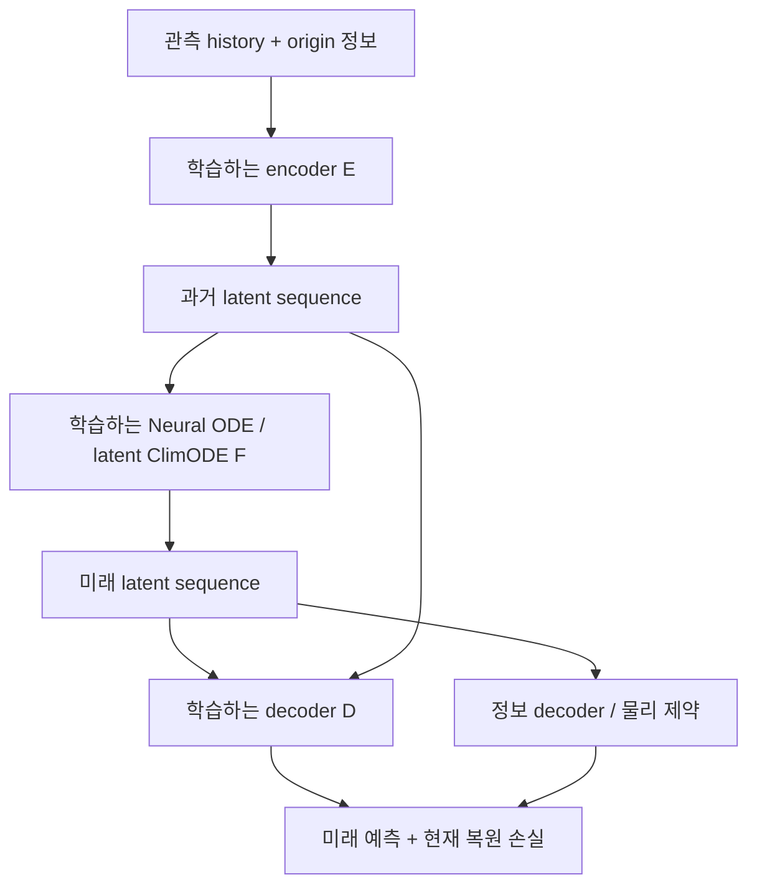

# Manifold와 예측기의 공동 학습

실험의 단위는 **encoder E + 실제 사용할 예측기 F + decoder D**입니다.
A를 먼저 학습하고 고정해야 한다는 조건을 제거했습니다. 기본 `--training-mode joint
--initialization fresh`에서는 세 구성요소를 새로 초기화하고 같은 미래 예측 목표로 함께 학습합니다.



미래 예측 오차는 D → F → E로 역전파됩니다. 정보 encoder, 정보 decoder 및 PINN
closure도 해당 손실이 활성화되면 함께 학습합니다. 독립 A 학습에 있던 보조 flow sampler와
A 자체 drift를 F 앞에 다시 연결하지 않습니다. 이 실험에서 시간 전개를 담당하는 것은 F입니다.

새 fresh 주실험의 E/D는 **공간 CNN encoder/decoder**입니다. 잠재 상태는
`[C_z, ceil(H/f), ceil(W/f)]`이며 기본 `C_z=32`, `f=2`, 공간 은닉 채널은 64입니다.
예를 들어 18×36 입력은 **32×9×18 = 5,184개 잠재 좌표**를 가집니다. 64차원 전역
벡터를 격자로 reshape한 구조가 아닙니다. 공통 인터페이스가 flat tensor를 전달하더라도
예측기 내부에서는 이 공간 shape를 복원해 연산합니다. 실제 격자 정보는 계약에 저장됩니다.

Neural ODE와 latent ClimODE는 같은 공간 E/D와 관측 history를 사용합니다. Neural ODE는
공간 CNN vector field를 적분하고, ClimODE adaptation은 학습한 transport 및 velocity
동역학으로 잠재장을 전개합니다. **잠재 채널과 transport 계수는 물리적 기상 변수·풍속이
아닙니다.** 원본 ClimODE의 물리 격자 모델 및 Gaussian head와 구분하며, 최종 기상장과
정보 head에서 물리/정보/PINN 손실을 계산합니다. 두 모델 모두 미래 latent를 D로 복원하므로
ClimODE에도 미래 정보/PINN 감독이 전달됩니다. Latent ClimODE에는 `--constants`가 필요하지
않으며 원본 격자 attention 모듈도 사용하지 않습니다.

잠재 수송은 원본의 중심차분을 upwind flux와 RK4로 바꾼 구현입니다. 전지구 경도는
주기 경계, 위도와 지역 격자의 가장자리는 수송 flux 0을 사용합니다. 이 선택은 수치 확산과
잠재 채널별 합 보존을 유도하며, 실제 대기의 질량 보존을 뜻하지 않습니다.
`--latent-max-speed` 기본 2는 **latent 셀/일** 단위의 수송 계수 상한입니다. 해상도에 따라
표현 가능한 이동 거리가 달라지므로 고해상도 실험에서는 조정해야 할 하이퍼파라미터입니다.
`--latent-max-acceleration` 기본 1은 내부 속도 좌표의 일당 변화율 상한이며 물리 가속도가 아닙니다.
Runner에서는 `LATENT_MAX_SPEED`, `LATENT_MAX_ACCELERATION`으로 지정합니다.
상한을 높이면 CFL 조건을 맞추기 위해 적분 횟수가 증가할 수 있습니다.

잠재 ClimODE의 출력은 결정론적입니다. 비선형 decoder를 통과한 기상장 분포가 Gaussian이라고
가정해 latent 표준편차를 기상장 CRPS에 넣지 않습니다. 이 경로의 CRPS는 `null`입니다.
공간 표현을 유지한다는 사실이 엄밀한 다양체 성질, PDE 보존, 예측 성능을 보장하지는 않습니다.

기존 DCT + 전역 MLP는 `--latent-layout global`로 유지합니다. 이 경우 `--manifold-dim 64`
및 `--manifold-hidden-dim 512`가 적용됩니다. 전역 latent ClimODE 연결은 거부하며,
전역 실험에는 MLP/Neural ODE를 선택합니다.

## 공통 예측 목표와 선택적 제약

\[
L=L_{\mathrm{forecast}}+\lambda_\Delta L_{\mathrm{tendency}}
 +\lambda_{\mathrm{rec}}L_{\mathrm{reconstruction}}
 +\lambda_{\mathrm{phys}}L_{\mathrm{surface\ physics}}
 +\lambda_I L_{\mathrm{information}}
 +\lambda_S L_{\mathrm{static}}
 +\lambda_Q L_{\mathrm{spatial\ distribution}}
 +\lambda_P L_{\mathrm{PINN}}.
\]

| 항목 | 기본 가중치 | 역할 |
|---|---:|---|
| Future forecast | 1 | 자유 rollout으로 예측한 미래 기상장과 실제 미래 비교 |
| Tendency | 0.1 | origin부터 각 인접 lead까지의 변화량 감독 |
| Reconstruction | 0.1 | 관측 입력의 표현 보존; off/on 대조군 모두 유지 |
| Surface physics | 0.01 | 실제 미래와 예측의 발산·와도·기압/기온 기울기·운동에너지 진단 비교 |
| Information | 0.1 | 정보 head의 복원 및 예측 latent에 대한 정보 감독 |
| Static | 0.05 | 예측 latent에서 고정 지형 정보 보존 |
| Spatial distribution | 0 | 선택적 결정론적 공간 분포 매칭; 앙상블 CRPS와 다름 |
| Hybrid PINN | 설정에 따름 | PINN이 활성화된 경우 저장/생성한 PINN 설정의 가중치 사용; `--pinn-weight`로 조정 |

Surface physics는 train 자료로 정한 scale을 사용합니다. 이는 실제 장의 물리적
진단량을 맞추는 감독이며 정확한 PDE 보존을 증명하지 않습니다. Hybrid PINN은 별도
기압면 방정식 잔차/closure 항이며 필요한 U/V/T/Z/omega/sp 자료가 있어야 합니다.
기존 독립 A의 flow matching·ensemble state/transition CRPS를 이 결정론적 학습 경로에
자동으로 이식하지 않습니다. `--distribution-weight`는 그 CRPS를 켜는 옵션이 아닙니다.

`--regularization none`은 추가 surface physics·information·static·distribution·PINN을
끄고 **동일한 future/tendency/reconstruction 목표를 유지**합니다. `full`은 설정된
가중치를 사용합니다. 따라서 공정한 최소 실험은 같은 E–F–D에서 `none` vs `full`입니다.
새로운 predictor마다 표현도 그 predictor와 공동 학습합니다.

## A 사전학습 없이 단일 모델 실행

저장소 루트에서 실행합니다. `surface.npz`와 schema sidecar가 필요합니다.

```bash
python -m climate_manifold.downstream.train \
  --archive /absolute/path/to/surface.npz \
  --information /absolute/path/to/information_pinn_shards \
  --training-mode joint --initialization fresh --regularization full \
  --model neural_ode --bridge latent --representation climate_manifold \
  --latent-layout spatial --latent-channels 32 --spatial-downsample 2 \
  --spatial-hidden-dim 64 --hidden-dim 128 \
  --history-steps 6 --history-stride 4 --horizon-steps 20 \
  --pinn --pinn-levels 500 850 --anchor none \
  --output runs/joint_neural_ode.pt --epochs 20 --batch-size 2 --device cuda

python -m climate_manifold.downstream.evaluate \
  --checkpoint runs/joint_neural_ode.pt \
  --archive /absolute/path/to/surface.npz \
  --information /absolute/path/to/information_pinn_shards \
  --split validation --output runs/joint_neural_ode.validation.json --device cuda
```

동일한 공간 표현의 ClimODE 실험은 위 명령에서 `--model climode`와 별도 output 경로를
사용합니다. 예측 경로는 **E → latent ClimODE → D**이고 `--climode-step-hours`의 기본값은
1시간입니다. CLI의 이름은 `climode`지만 이 경로는 원본을 그대로 실행하는 것이 아닌 latent adaptation입니다.

PINN가 필요 없으면 `--pinn --pinn-levels 500 850`를 빼고, surface-only 실험이면
`--information`도 뺍니다. Mode는 information 제공 여부로 결정하며 `--mode surface|enriched`로
명시할 수도 있습니다. 기본 6시간 자료에서 history_stride 4는 과거 6장을 **24시간
간격**으로 입력한다는 뜻입니다. 출력 20장은 6시간 간격의 120시간 예측입니다.

기존 **전역 A** 가중치로 시작하여 Neural ODE를 함께 미세조정하려면 위 명령의
spatial 옵션을 제거하고 다음을 적용합니다:

```bash
--a-checkpoint /absolute/path/to/manifold.pt --initialization pretrained --latent-layout global
```

`--a-checkpoint`만 제공하고 `--initialization fresh`를 유지하면 데이터·정규화·분할 계약을
재사용하면서 새로운 공간 표현을 초기화합니다. `--latent-layout`을 생략한 fresh 실행은
spatial이고, pretrained/frozen 실행은 checkpoint의 표현 종류를 이어받습니다.
**전역 A 가중치를 spatial로 바꾸어 불러올 수는 없습니다.** 이 조합은 명시적으로 거부합니다.
`pretrained`는 선택적 초기화이며 freezing을 뜻하지 않습니다. Raw 기준선에는 latent E/D
예측 경로가 없으므로 표현 공동 학습을 주장하지 않습니다.

## 저장과 적용

학습은 `train`, checkpoint 선택은 `calibration`의 **공통 미래 state MSE**를 씁니다.
보조 loss가 작아졌다는 이유로 한 비교군에 유리한 checkpoint를 선택하지 않습니다.
`validation`에서 개발 평가 후 설정을 확정하고 마지막에 `test`를 평가합니다.
기상장·정보 정규화는 train 자료에서만 적합하며 추론 때 고정합니다. Fresh 모델의 latent는
처음부터 identity 좌표를 사용하고, pretrained 모델은 기존 latent mean/scale을 고정해서
사용합니다. 학습 후 다시 latent 좌표를 바꾸어 예측기와 decoder의 좌표 계약을 깨지 않습니다.

미래 surface/상층 정보는 손실의 목표로만 사용합니다. 추론은 관측 history와 origin 정보로
시작하며 미래 정답을 입력하지 않습니다. 학습된 E/F/D, 정보 head 및 정규화/데이터 계약을
하나의 예측 checkpoint와 manifest에 저장하므로 원래 A 파일 없이 재로드할 수 있습니다.
비교군마다 잠재 좌표가 달라질 수 있어 우열은 원래 기상장 단위 RMSE/ACC로 판단합니다.

기존 frozen 결과는 `--training-mode frozen --initialization pretrained`로 명시적으로
재현할 수 있습니다. 새 joint 학습의 대조 실험이며 기본 주실험은 아닙니다.
ClimODE 주실험은 **공간 E → latent ClimODE → D**입니다. 과거의 `E → D → ClimODE`
연결은 `--experiment auxiliary --bridge decoded`로 남겨둔 입력 복원 보조 실험이며,
latent forecasting 결과와 구분합니다. Raw/decoded ClimODE에는 실제 constants가 필요합니다.
