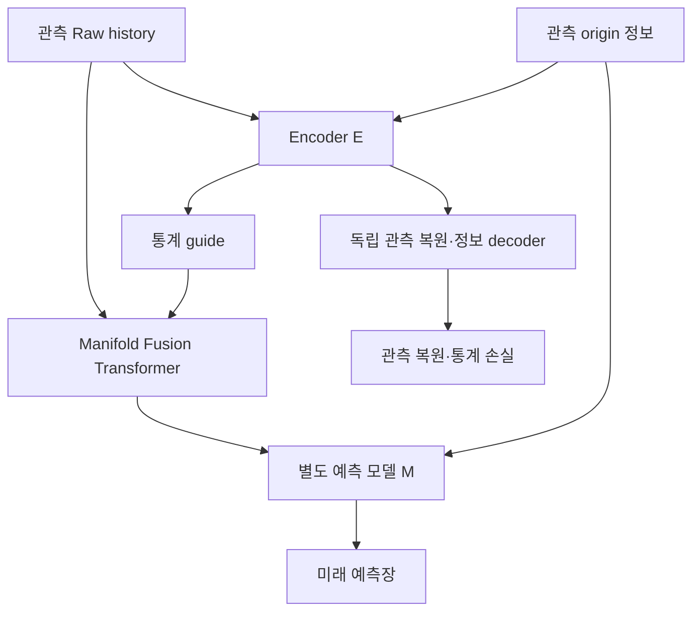

# 통계 guide와 Raw를 결합하는 Climate Manifold 실험

브랜치: `feature/manifold-fusion-experiments`

**제안하는 manifold는 Encoder와 Fusion Transformer가 함께 구성하는 표현입니다.**
Encoder E가 관측 자료에서 통계 guide를 만들고, Fusion Transformer T가 Raw와 guide를
결합합니다. 별도의 예측 모델 M이 그 표현을 받아 미래 기상장을 예측합니다.

\[
g=E_\theta(X,I),\qquad H=T_\psi(X,g)=X+\Delta_\psi(X,g),\qquad
\widehat Y=M_\phi(H,I).
\]

`H`는 관측 history와 같은 격자·채널·시간 길이를 가진 학습된 표현입니다. T는 미래
lead를 입력받아 예측하는 모듈이 아닙니다. `M`을 바꾸어도 이 앞단 manifold 구조를
유지합니다. 여기서 manifold는 연구 대상인 학습된 표현의 명칭이며, 수학적 다양체의
차원·정칙성이나 물리 법칙 만족이 자동으로 보장된다는 뜻은 아닙니다.



## 비교군과 연구 질문

| 실행 arm | 예측 경로 | 확인하는 내용 |
|---|---|---|
| `raw` | Raw → M | 같은 예측 모델의 기준 성능 |
| `latent` | E → M → D_forecast | 기존 압축 latent 방식 |
| `guided` | Raw + E guide → T → M | 제안하는 통합 manifold의 성능 |
| `guided_zero` | Raw + 0 guide → 동일 T → M | 동일 Fusion 구조에서 guide 내용의 기여 |
| `guided_forecast_only` (선택) | Raw + E guide → 동일 T → M | 관측 복원·통계 제약을 함께 추가하는 효과 |

`guided_forecast_only`는 E/T/M을 예측 손실만으로 학습합니다. `guided`와의 비교는
**관측 복원과 통계 손실 전체의 추가 효과**이며, 통계 손실만의 효과를 분리하지는
않습니다. `guided_zero`에는 관측 보조 손실이 유지되지만 예측기는 E가 만든 guide
내용을 받지 않습니다.

Raw 대비 Guided의 차이에는 추가 Encoder/Transformer 용량과 보조 감독이 모두
포함됩니다. guide 효과의 근거로는 Guided 대 Zero-guide, 보조 감독의 근거로는
Guided 대 Forecast-only를 함께 확인하세요. 서로 다른 M 사이의 순위보다 **같은 M,
같은 seed, 같은 평가 origin/lead에서의 변화**가 주된 결과입니다.

지원하는 M은 `mlp neural_ode climode convlstm simvp fourcastnet climax transformer`
8종입니다. `mlp`라는 기존 이름은 이 spatial 경로에서 CNN 기반 rate network를
가리킵니다. 후단 M을 `transformer`로 선택하면 앞단 Fusion T와 **별개의** 예측용
Transformer가 연결됩니다. ClimODE는 transport adaptation이며, FourCastNet/ClimaX
등도 현재 변수·격자에서 학습하는 연결 모델입니다. 공식 논문의 원본 해상도,
사전학습 checkpoint와 benchmark를 재현한 비교로 해석하지 않습니다.

기본은 **8개 M × 4개 arm × 3개 seed = 96회 학습**입니다.
`INCLUDE_GUIDED_FORECAST_ONLY=1`이면 **120회**입니다. 한 실행에는 한 종류의 통계
손실만 사용합니다. `STATISTICAL_LOSS=w2`가 기본이며 `kl_entropy`와 `signed_measure`
실험에는 각각 새 `RUN`을 사용합니다.

## 공동 학습과 정보 보존

- Guided의 예측 손실은 E/T/M을 공동 학습합니다. A를 먼저 학습해 고정하지 않습니다.
- 독립된 `D_rec`는 관측 기상장, `D_info`는 관측 정보장을 복원합니다. 관측 손실은
  E와 해당 decoder를 직접 학습하며 T/M을 직접 통과하지 않습니다.
- Guided에서는 `D_forecast`를 사용하지 않고 잠급니다. Latent 대조군에서는
  E/M/D_forecast가 함께 예측을 학습합니다.
- 기본 `CONSTRAINT_DECODER=separate_surface_and_information`이 해면기압을 포함한
  surface 통계 감독을 유지합니다. `information_only`는 sidecar 변수만 감독하므로,
  sidecar에 해면기압이 없으면 해당 분포 손실도 없습니다.
- PINN, static penalty 및 봉인한 두 flow objective는 이 실험에서 꺼집니다.
  지형 등 static **입력 정보**는 유지합니다.
- guide는 결정론적입니다. W2/KL/signed-measure 감독 자체가 확률 샘플링이나
  보정된 기상 앙상블을 만들어 주지는 않습니다.
- Fusion의 마지막 보정 head는 0으로 초기화되어 처음에는 `H=X`입니다. 첫 update에서
  예측 손실의 E/T 내부 gradient가 0일 수 있으며, 보정 head가 학습되면서 연결됩니다.

`GUIDE_DIRECT_INFORMATION=1`이 기본입니다. Raw와 Guided의 후단 M에 같은 origin
정보를 제공해 입력 정보의 차이를 줄입니다. E가 받는 보조 정보는 origin 시점 정보를
history에 broadcast한 것이며, 모든 과거 시점에 독립적으로 정합한 정보 시계열은
아닙니다. 미래 자료는 label로만 사용합니다.

W2는 공간 값의 주변분포/분위수를 비교하므로 고·저기압의 위치를 단독으로 보존하지
않습니다. KL은 관측→복원 soft histogram 비교이며 VAE prior KL이 아닙니다.
Signed measure는 정규화 좌표의 0을 기준으로 양/음의 공간 질량을 비교합니다.
그 기준은 물리 단위의 0 Pa가 아닙니다.

## 새 브랜치 받기부터 학습·test·그래프까지

할당받은 GPU 세션에서 실행하세요. 원본 ERA5는
`/lustre/home/mahmed/ERA5_0p25_DAILY`에서 읽기만 합니다. 코드, 가상환경, 전처리,
캐시, 로그와 결과는 모두 `/lustre/home/yehyeon` 아래에 둡니다.

일별 기본 실험은 **16×32 격자, 연속 6일 관측 → 미래 1~5일 예측**, batch 16,
20 epochs입니다. 원본 721×1440 해상도의 예측 실험은 아닙니다. 아래 블록은
설정을 고정한 full 실험을 위해 별도 test 평가까지 켭니다. 설정 탐색 중에는
`EVALUATE_TEST=0`으로 test를 남겨두세요.

```bash
bash <<'BASH'
set -euo pipefail
export ERA5_ROOT=/lustre/home/mahmed/ERA5_0p25_DAILY
cd /lustre/home/yehyeon
export DAILY_WORK
DAILY_WORK=$(mktemp -d "$PWD/climate_manifold_fusion_XXXXXXXX")
mkdir -p "$DAILY_WORK"/{tmp,cache,logs}
export TMPDIR="$DAILY_WORK/tmp" TMP="$DAILY_WORK/tmp" TEMP="$DAILY_WORK/tmp"
export XDG_CACHE_HOME="$DAILY_WORK/cache" PIP_CACHE_DIR="$DAILY_WORK/cache/pip"
export TORCH_HOME="$DAILY_WORK/cache/torch" HF_HOME="$DAILY_WORK/cache/huggingface"
export CUDA_CACHE_PATH="$DAILY_WORK/cache/cuda" TRITON_CACHE_DIR="$DAILY_WORK/cache/triton"
export PYTHONPYCACHEPREFIX="$DAILY_WORK/cache/pycache" MPLCONFIGDIR="$DAILY_WORK/cache/matplotlib"
export NUMBA_CACHE_DIR="$DAILY_WORK/cache/numba" PYTHONNOUSERSITE=1

git clone --single-branch --branch feature/manifold-fusion-experiments \
  https://github.com/nayehyeon61-glitch/climate_manifold.git "$DAILY_WORK/code"
cd "$DAILY_WORK/code"
python3 -m venv "$DAILY_WORK/venv"
source "$DAILY_WORK/venv/bin/activate"
python -m pip install --upgrade pip
python -m pip install 'torch==2.8.0' --index-url https://download.pytorch.org/whl/cu128
python -m pip install 'xarray==2024.11.0' -e '.[forecast,era5,test,plots]'

export PYTHON="$DAILY_WORK/venv/bin/python"
export DEVICE=cuda BATCH_SIZE=16 EPOCHS=20 SEEDS="7 19 43"
export MODELS="mlp neural_ode climode convlstm simvp fourcastnet climax transformer"
export STATISTICAL_LOSS=w2 INCLUDE_ZERO_GUIDE=1 INCLUDE_GUIDED_FORECAST_ONLY=0
export GUIDE_DIRECT_INFORMATION=1 VARIABLE_CONDITIONING=0
export CONSTRAINT_DECODER=separate_surface_and_information
export STATISTICAL_FLOW_WEIGHT=0 CONDITIONAL_FLOW_WEIGHT=0
export START_DATE=1979-01-01 END_DATE=2025-12-31
export TARGET_LAT_POINTS=16 TARGET_LON_POINTS=32
export HISTORY_STEPS=6 HISTORY_STRIDE=1 HORIZON_STEPS=5 WINDOW_STRIDE=1
export MAX_WINDOWS=0 MAX_CASES=0 ORIGIN_STRIDE=1
export RUN_PREFLIGHT_TESTS=1 EVALUATE_TEST=1 MAKE_PLOTS=1 OMP_NUM_THREADS=4
export GPU_MAX_UTILIZATION=10 GPU_MAX_MEMORY_PERCENT=10 GPU_MIN_FREE_GIB=8
export GPU_WAIT_SECONDS=0
unset ARCHIVE INFO A_CHECKPOINT RUN RESUME
git log -1 --oneline
printf 'Work directory: %s\n' "$DAILY_WORK"
bash scripts/run_daily_manifold_fusion.sh
BASH
```

CUDA 12.8용 PyTorch는 서버 driver/GPU와 호환되어야 합니다. GPU guard는 할당된
가시 GPU 중 시작 시 사용률 ≤10%, 메모리 점유율 ≤10%, 여유 메모리 ≥8 GiB인 장치를
선택하고 각 학습/평가 전에 다시 확인합니다. 실행 중인 compute process가 있는 GPU도
제외합니다. 위 명령의 `GPU_WAIT_SECONDS=0`은 빈 GPU가 없으면 중단합니다.
`GPU_WAIT_SECONDS=300`으로 지정하면 300초 간격으로 다시 확인하며 다른 작업을 종료하지 않습니다.
학습 중 사용률을 10%로 제한하는 기능은 아닙니다. 경로 검사도 애플리케이션의
출력 경로 검사이며 운영체제 sandbox를 구성하는 기능은 아닙니다.

실행 순서는 경로·CUDA 확인 → CPU 합성 테스트 → 데이터 준비 → 모든 학습 및 validation
집계·그래프 → 고정된 checkpoint의 test 평가·그래프입니다. Calibration으로
checkpoint를 선택하며, test 점수는 학습·선택에 사용하지 않습니다. Seed 분산은
반복 학습 변동성이며 기상 앙상블 불확실성이 아닙니다.

## 작은 실행, 손실 교체, 재개

위 블록은 별도 shell이므로 이후 작업에는 출력된 작업 폴더를 다시 지정하세요.
아래 `<작업폴더>`를 실제 생성된 경로로 바꾸고 실행합니다. 같은 전처리를 재사용하며
새 학습 폴더를 자동 생성합니다.

```bash
export DAILY_WORK='/lustre/home/yehyeon/<작업폴더>'
export ERA5_ROOT=/lustre/home/mahmed/ERA5_0p25_DAILY
cd "$DAILY_WORK/code"
source "$DAILY_WORK/venv/bin/activate"
export PYTHON="$DAILY_WORK/venv/bin/python"
unset RUN RESUME A_CHECKPOINT
MODELS=mlp SEEDS=7 EPOCHS=1 MAX_WINDOWS=8 MAX_CASES=2 EVALUATE_TEST=0 \
  bash scripts/run_daily_manifold_fusion.sh
```

소형 실행은 연결·저장·평가 확인용이며 예측력의 근거가 아닙니다. Full 실험에서
W2 대신 다른 손실을 비교하려면 동일한 모델/seed/학습 설정으로
`STATISTICAL_LOSS=signed_measure` 또는 `kl_entropy`를 지정하세요. 다른 설정을
같은 `RUN`에 섞지 않습니다. `INCLUDE_GUIDED_FORECAST_ONLY=1`로 보조 감독 대조군을
추가할 수 있습니다. 변수별 encoder 실험은 `VARIABLE_CONDITIONING=1`입니다.

`RESUME=1 RUN="$DAILY_WORK/runs/<기존결과폴더>"`는 데이터·설정·코드·실행 환경이 기존
실험 manifest와 일치할 때 완료된 작업을 재사용합니다. 중단된 optimizer 상태를
이어 학습하는 기능은 아닙니다. 완료되지 않은 checkpoint 충돌은 별도 새 `RUN` 등
명시적 복구가 필요합니다. 비교 CSV 누락이나 그래프 생성 중단은 완료된 학습을
재사용하여 분석만 복구하며, 미완성 그래프는 별도 `.partial-*` 폴더에 보존합니다.
설정을 바꿔 기존 결과를 덮어쓰지 않습니다.

이미 준비된 별도 archive를 사용하려면 저장소 루트에서
`ARCHIVE`, `INFO`, 새 `RUN`을 설정하고 `scripts/run_guided_fusion_comparison.sh`를
사용합니다. 이 하위 runner는 schema의 24시간/6시간 간격에 맞는 기본 history와
horizon을 선택합니다. 서버 경로·전처리·GPU 관리를 함께 적용하려면 위 일별 wrapper를
사용하세요. 예전 `run_raw_latent_comparison.sh`와
`run_guided_transformer_comparison.sh`는 각각 이전 실험을 보존하며 이 새 실험을
자동으로 대신 실행하지 않습니다.

## 결과와 해석

결과 경로는 `$DAILY_WORK/runs/` 아래 생성된 실행 폴더입니다.

| 결과 | 내용 |
|---|---|
| `run-manifest.json` | 코드·데이터·실행 설정·환경의 재개 확인용 기록 |
| `*.pt`, `*.manifest.json`, `*.metrics.json` | checkpoint, 실행 계약, 학습 기록 |
| `*.validation.json`, `*.test.json` | 변수·lead별 물리 단위 RMSE/ACC와 모델/입력 메타데이터 |
| `comparison.json`, `comparison.test.json` | validation/test 비교와 seed 집계 |
| `comparison*.guide-effects.csv` | zero-guide 및 선택적 관측 제약 대조 효과 |
| `comparison*.raw-effects.csv` | 같은 M의 Raw 대비 Latent/Guided 효과 |
| `comparison*.route-effects.csv` | Latent와 Guided 경로 비교 |
| `plots/validation/`, `plots/test/` | PNG/PDF, 집계 CSV, 그래프 입력 manifest |

변수별 RMSE/ACC 곡선과 Raw 대비 RMSE 감소율을 생성합니다.
`guide_gain_percent_by_lead_<변수>`는 Learned 대 Zero-guide,
`constraint_gain_percent_by_lead_<변수>`는 제약 유무의 RMSE 감소율입니다.
각 seed에서 짝지어 계산하며 양수가 개선입니다. 후자는 해당 선택 대조군을 실행했을
때 생성됩니다. 그림의 띠/오차막대는 seed 간 표본 표준편차로 신뢰구간이 아닙니다.

같은 평가 origin과 실패 표본 집합에서 비교하며 변수별 단위를 유지합니다. 서로 다른
변수의 물리 RMSE를 단순 합산하여 순위를 만들지 않습니다. 지도·태풍 사례와 장기
안정성 검증은 별도 분석이 필요하며 이 matrix의 RMSE/ACC만으로 증명되지 않습니다.

학습 없이 그래프를 재생성하려면 기존 비교 JSON과 새로운 출력 폴더를 지정합니다.

```bash
export RUN="$DAILY_WORK/runs/<결과폴더>"
python -m climate_manifold.downstream.plot_comparison \
  --comparison "$RUN/comparison.test.json" \
  --output "$RUN/plots/test-redrawn-$(date +%Y%m%d-%H%M%S)"
```

핵심 코드는 `src/climate_manifold/downstream/guided_fusion.py`(T),
`pipeline.py`(E/T/M 연결), `reconstruction_objective.py`(관측 제약),
`train.py`(공동 학습), `compare.py` 및 `plot_comparison.py`입니다.
소프트웨어 테스트와 합성 실행은 구조의 동작을 검증하며 실제 ERA5 성능 향상 결과를
대체하지 않습니다.
