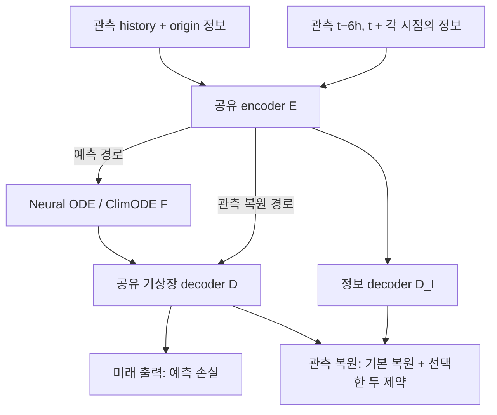

# 예측과 표현 제약을 분리한 쌍별 실험

이 브랜치의 새 실험은 하나의 encoder와 decoder를 공유하는 두 경로를 함께 학습합니다.
예측은 `E → F → D`, 표현 제약은 **관측 자료를 직접 복원하는 `E → D / D_I`**에서
계산합니다. 표현 제약 계산은 예측기 `F`를 호출하지 않습니다.



`D`는 동일한 가중치로 관측 복원과 미래 기상장 출력을 담당합니다. `D_I`는 상층 변수와
지형 정보를 복원하는 보조 decoder입니다. 새로운 예측기나 별도의 encoder를 추가하지 않습니다.
PINN closure도 관측 복원 latent에서만 계산합니다. 이 학습의 추론 경로는 그대로
`관측 history → E → F → D → 미래 기상장`입니다.

## 정확히 두 개의 추가 제약

| `--constraint-pair` | PINN | Statistical | Static |
|---|---|---|---|
| `pinn_statistical` | 사용 | 사용 | 미사용 |
| `pinn_static` | 사용 | 미사용 | 사용 |
| `statistical_static` | 미사용 | 사용 | 사용 |

- **PINN:** 복원한 두 관측 시점의 기압면 운동량·온도·연속·층 두께 잔차와 closure 크기 규제.
  PDE 안의 시간차분은 유지하지만 기존의 별도 관측 tendency 감독과 지표 tendency 보조항은
  포함하지 않습니다. `HybridPINN.forward(include_tendency=False)`로 명시합니다.
- **Statistical:** 복원한 동적 지표 기상장 및 동적 상층 정보장의 면적 가중 공간 분위수 매칭.
  각 변수와 시점을 따로 비교합니다. 고정 지형을 포함하지 않으며, 앙상블 CRPS가 아닙니다.
- **Static:** 정보 decoder가 복원한 고정 변수의 면적 가중 L². 두 시점 모두 origin의 고정
  정보를 목표로 사용합니다. 현재 자료 계약에서는 지형 높이·경사가 해당합니다.
  위경도는 격자 좌표이며 별도의 학습 대상 변수로 추가되지 않습니다.

동적 자료의 기본 복원오차는 세 조합에 공통으로 **한 번** 유지합니다.

\[
L_{\rm rec}=\tfrac12\bigl(L_{\rm surface\ reconstruction}
                         +L_{\rm dynamic\ information\ reconstruction}\bigr).
\]

각 항은 train 자료로 정규화한 변수별 면적 가중 MSE를 평균합니다. Static 변수는 여기서
제외하여 Static 제약의 on/off 의미를 유지합니다. 이 공통 오차는 PINN+Static에서 상층
decoder가 물리 잔차만 작은 상수장을 출력하는 퇴화해를 견제합니다. Statistical 그룹은
이 점별 복원과 구별되는 **분포 매칭**입니다.

\[
L = L_{\rm forecast}+\lambda_\Delta L_{\rm future\ tendency}
    +\lambda_{\rm rec}L_{\rm rec}
    +\sum_{g\in\text{선택한 두 그룹}}\lambda_g L_g.
\]

기본 외부 가중치는 reconstruction 0.1, statistical 0.1, static 0.05, PINN 0.1입니다.
미래 tendency는 기존 예측 손실의 설정을 사용합니다. 예측장 surface physics, 미래 information
MSE, 미래 분포·static·PINN은 이 경로에서 추가로 부과하지 않습니다.

## 자료와 gradient 계약

기본 예측 입력은 24시간 간격의 6개 관측 지표장과 origin 정보이며, 출력은 6시간 간격의
20개 미래장입니다. 제약 경로는 같은 관측 구간 안의 **origin−6h와 origin** 두 장만 가져와
각 시점에 정확히 대응하는 정보 자료와 함께 복원합니다. 예측 입력의 24시간 간격을
6시간이라고 가정하지 않습니다. 두 장이 모두 관측 구간에 있어야 하므로 history span은
최소 2개의 원자료 시점이어야 합니다.

`constraint_states`, `constraint_information`, `constraint_dt_hours`는 제약 손실에만
전달됩니다. 미래 상층 정보는 제약 경로에서 읽지 않습니다. train/calibration/validation/test
분할과 train-only 정규화는 기존 자료 계약을 유지합니다.

제약 손실만 역전파하면 `F`에는 gradient가 없고, 공유 `E`, `D`, `D_I` 및 활성 closure에
전달됩니다. 미래 예측 손실은 `E`, `F`, `D`를 함께 갱신합니다. 공유 encoder/decoder를 통해
제약이 예측에 간접 영향을 주므로 두 학습 목적이 완전히 독립이라는 의미는 아닙니다.

## 전체 세 조합 실행

저장소 루트에서 다음을 실행합니다. INFO에는 같은 기압면의 U/V/T/Z/omega와 실제 지표기압
sp가 필요하며, 두 PINN 조합에서는 모듈이 자동으로 활성화됩니다. Statistical+Static은
PINN 모듈 없이 실행합니다.

```bash
export ARCHIVE=/absolute/path/to/surface.npz
export INFO=/absolute/path/to/information_pinn
export RUN=runs/split_pairs_001
export DEVICE=cuda MODELS="neural_ode climode" SEEDS="7 19 43"
export EPOCHS=20 BATCH_SIZE=2
bash scripts/run_pairwise_manifold_comparison.sh
```

기본 구성은 2개 예측기 × 3개 제약 조합 × 3개 seed의 18회 학습입니다. 각 실행은 공통
calibration 미래 MSE로 checkpoint를 선택하고 같은 물리장 평가를 사용합니다.
처음 확인할 때는 `MODELS=neural_ode SEEDS=7`로 3회 학습만 수행할 수 있습니다.

단일 조합은 다음과 같이 실행합니다.

```bash
python -m climate_manifold.downstream.train \
  --archive "$ARCHIVE" --information "$INFO" \
  --training-mode joint --initialization fresh \
  --bridge latent --model neural_ode --latent-layout spatial \
  --constraint-pair pinn_statistical \
  --reconstruction-weight 0.1 --statistical-weight 0.1 --pinn-weight 0.1 \
  --epochs 20 --batch-size 2 --device cuda \
  --output runs/split_single/model.pt
```

새 경로는 `--constraint-pair`로 선택합니다. 지정하지 않은 기존 학습 명령과
`run_model_comparison.sh`는 예측 궤적에 보조 제약을 적용하던 기존 실험을 재현합니다.
새 쌍별 runner에는 기존 `INFORMATION_WEIGHT`, `PHYSICS_WEIGHT`, `DISTRIBUTION_WEIGHT`
설정이 필요하지 않습니다. 실제 활성 가중치와 경로는 checkpoint와 평가 보고서에 기록됩니다.

## 결과 해석

세 조합은 같은 자료·예측기·seed·학습 예산에서 비교합니다. 예를 들어 PINN+Static과
Statistical+Static은 Static을 공유하면서 다른 제약을 교체하는 비교입니다. 한 그룹만
추가한 실험은 아니므로 그 차이를 PINN 하나의 인과적 효과로 해석하지 않습니다.

보고서는 조합별로 seed를 집계하며 서로 다른 조합을 한 모델의 반복 실행처럼 합치지
않습니다. 변수·lead별 물리 단위 RMSE/ACC, 장기 rollout의 유한성, 계산 비용을 평가합니다.
학습/검증 오차의 차이와 여러 seed의 결과를 확인해야 과적합 변화에 대해 판단할 수 있습니다.
경로 분리나 손실 항 개수 감소 자체는 일반화 개선을 보장하지 않습니다.

이 설계는 **관측된 상태들의 표현**에 물리 제약을 주며, 생성된 미래 궤적의 PDE 만족을
직접 감독하지 않습니다. 특히 관측 복원 PINN 잔차가 작다는 사실만으로 미래 궤적의 물리적
타당성을 주장할 수 없습니다.

## 구현 검증

전체 테스트 296개를 통과했습니다. 제약만 역전파했을 때 예측기 F의 gradient가 없는지,
미래 information을 바꾸어도 관측 제약이 변하지 않는지, 세 조합의 활성 항과 checkpoint
재로딩이 올바른지를 확인했습니다. 추가로 합성 자료에서 Neural ODE·ClimODE × 세 조합을
각각 1 epoch 학습하고 120시간 예측·평가·조합별 집계를 완료했습니다. 6개 실험 모두
동일한 평가 origin에서 유한한 출력을 생성했습니다. 이는 소프트웨어 동작 검증이며,
실제 기상 예측력이나 과적합 감소의 근거는 아닙니다.

## 코드 위치

| 역할 | 코드 |
|---|---|
| 관측 쌍 구성·학습 분기·메타데이터 | `src/climate_manifold/downstream/train.py` |
| E→D 제약 계산·쌍별 활성화 | `src/climate_manifold/downstream/reconstruction_objective.py` |
| 물리 잔차와 선택적 tendency 감독 | `src/climate_manifold/hybrid_pinn.py` |
| 예측 E→F→D | `src/climate_manifold/downstream/pipeline.py` |
| 전체 쌍별 실행 | `scripts/run_pairwise_manifold_comparison.sh` |
| 평가 및 조합별 집계 | `src/climate_manifold/downstream/evaluate.py`, `compare.py` |
