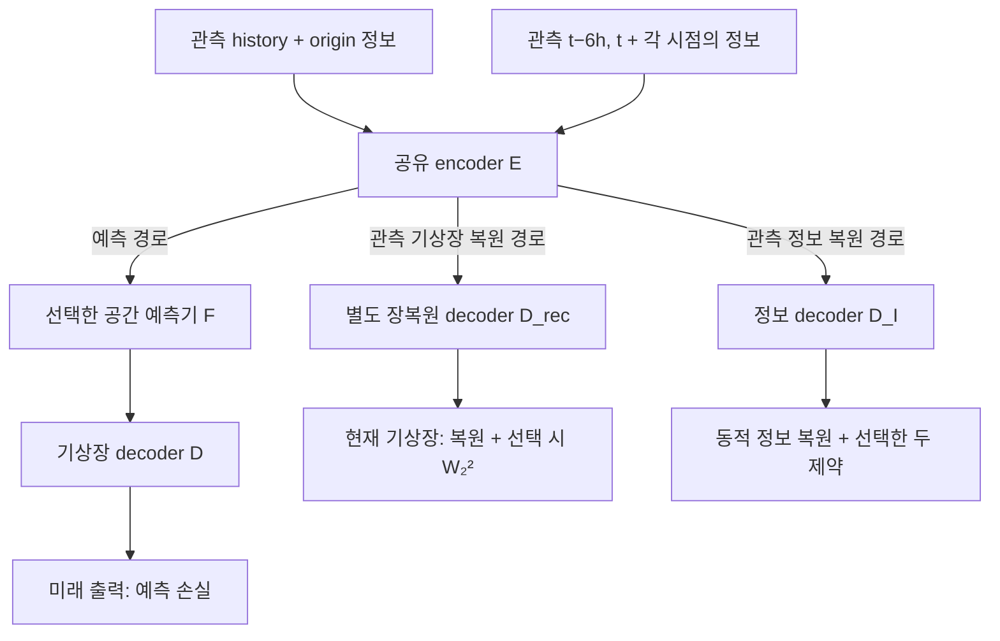

# 예측과 표현 제약을 분리한 쌍별 실험

이 브랜치의 새 실험은 하나의 encoder를 공유하는 두 경로를 함께 학습합니다.
예측은 `E → F → D`, 표현 제약은 **관측 기상장의 `E → D_rec`와 관측 정보의 `E → D_I`**에서
계산합니다. D_rec는 예측 decoder D와 독립된 장복원 decoder입니다. 표현 제약 계산은
예측기 `F`와 예측 decoder `D`를 호출하지 않습니다.



기본 `--constraint-decoder separate_surface_and_information`에서는 관측 기상장 복원을
독립된 D_rec에 맡깁니다. D_rec는 D와 같은 구조·초기 가중치로 시작하지만 파라미터를 공유하지
않습니다. **D 자체를 동결하는 것은 아닙니다.** D는 미래 기상장 예측 손실로 계속 학습합니다.
`D_I`는 상층 변수와 지형 정보를 복원하는 보조 decoder입니다. 예측기나 encoder를 별도로
복제하지 않습니다. D_rec는 새 분리 모드에만 추가되며 Raw와 기존 모드의 구조는 유지합니다.
PINN closure도 관측 복원 latent에서만 계산합니다. 이 학습의 추론 경로는 그대로
`관측 history → E → F → D → 미래 기상장`입니다.

기존 경로도 삭제하지 않습니다. 아래 옵션은 `--constraint-pair`를 사용하는 latent 공동 학습에만 적용합니다.

| `--constraint-decoder` | 관측 기상장 복원 | 관측 정보 복원 | 제약이 예측 D를 직접 갱신 |
|---|---|---|---|
| `separate_surface_and_information` (기본) | 별도 D_rec | D_I | 아니요 |
| `information_only` | 사용 안 함 | D_I | 아니요 |
| `surface_and_information` | 예측 D 공유 | D_I | 예 |

## 정확히 두 개의 추가 제약

| `--constraint-pair` | PINN | Statistical | Static |
|---|---|---|---|
| `pinn_statistical` | 사용 | 사용 | 미사용 |
| `pinn_static` | 사용 | 미사용 | 사용 |
| `statistical_static` | 미사용 | 사용 | 사용 |

- **PINN:** 복원한 두 관측 시점의 기압면 운동량·온도·연속·층 두께 잔차와 closure 크기 규제.
  PDE 안의 시간차분은 유지하지만 기존의 별도 관측 tendency 감독과 지표 tendency 보조항은
  포함하지 않습니다. `HybridPINN.forward(include_tendency=False)`로 명시합니다.
- **Statistical:** 기본값에서는 D_rec의 관측 기상장과 D_I의 동적 정보장에 면적 가중 공간 분위수 W₂² 매칭.
  각 변수와 시점을 따로 비교합니다. 고정 지형을 포함하지 않으며, 앙상블 CRPS가 아닙니다.
  **해면기압 `msl`을 포함한 surface archive의 모든 변수**가 기상장 분포 손실에 포함됩니다.
  해면기압에만 걸리는 손실은 아닙니다. `information_only`에서는 동적 정보 W₂²만 사용하므로
  기상장 W₂²와 `msl` 분포 손실이 꺼집니다. D_I에는 `msl` 출력을 추가하지 않습니다.
  이전 `surface_and_information`에서는 같은 기상장 손실을 예측 D로 계산합니다.
- **Static:** 정보 decoder가 복원한 고정 변수의 면적 가중 L². 두 시점 모두 origin의 고정
  정보를 목표로 사용합니다. 현재 자료 계약에서는 지형 높이·경사가 해당합니다.
  위경도는 격자 좌표이며 별도의 학습 대상 변수로 추가되지 않습니다.

기상장과 동적 정보의 기본 복원오차는 세 조합에 공통으로 **한 번씩** 유지합니다.

\[
L_{\rm rec}=\tfrac12\left(L_{\rm surface\ reconstruction}^{D_{\rm rec}}
  +L_{\rm dynamic\ information\ reconstruction}^{D_I}\right),
\qquad
L_{\rm statistical}=\tfrac12\left(L_{\rm surface\ W_2^2}^{D_{\rm rec}}
  +L_{\rm dynamic\ information\ W_2^2}^{D_I}\right).
\]

복원 항은 train 자료로 정규화한 변수별 면적 가중 MSE를 평균합니다. Static 변수는 여기서
제외하여 Static 제약의 on/off 의미를 유지합니다. 이 공통 오차는 PINN+Static에서 상층
decoder가 물리 잔차만 작은 상수장을 출력하는 퇴화해를 견제합니다. Statistical 그룹은
이 점별 복원과 구별되는 **분포 매칭**입니다.

기본값과 이전 `surface_and_information`은 reconstruction과 Statistical 각각에 같은
`0.5 × (기상장 손실 + 동적 정보 손실)`을 사용하고, 기상장 손실을 받는 decoder가 다릅니다.
`information_only`는 제거한 기상장 항을 0으로 두고 평균하는 대신 정보 손실 자체를 사용합니다.
따라서 외부 가중치가 같아도 정보 전용 모드는 정보 항의 실효 가중치가 다릅니다.
실험 비교 시 decoder 모드와 가중치를 함께 기록합니다.

\[
L = L_{\rm forecast}+\lambda_\Delta L_{\rm future\ tendency}
    +\lambda_{\rm rec}L_{\rm rec}
    +\sum_{g\in\text{선택한 두 그룹}}\lambda_g L_g.
\]

기본 외부 가중치는 reconstruction 0.1, statistical 0.1, static 0.05, PINN 0.1입니다.
미래 tendency는 기존 예측 손실의 설정을 사용합니다. 예측장 surface physics, 미래 information
MSE, 미래 분포·static·PINN은 이 경로에서 추가로 부과하지 않습니다.

## 자료와 gradient 계약

기본 예측 입력은 24시간 간격의 6개 관측 지표장과 origin 정보이며, 출력은 6시간 간격의
20개 미래장입니다. 제약 경로는 같은 관측 구간 안의 **origin−6h와 origin** 두 장만 가져와
각 시점에 정확히 대응하는 정보 자료와 함께 복원합니다. 예측 입력의 24시간 간격을
6시간이라고 가정하지 않습니다. 두 장이 모두 관측 구간에 있어야 하므로 history span은
최소 2개의 원자료 시점이어야 합니다.

`constraint_states`, `constraint_information`, `constraint_dt_hours`는 제약 손실에만
전달됩니다. 미래 상층 정보는 제약 경로에서 읽지 않습니다. train/calibration/validation/test
분할과 train-only 정규화는 기존 자료 계약을 유지합니다.

기본 분리 모드에서 제약 손실만 역전파하면 `F`와 예측 `D`에는 gradient가 없고,
공유 `E`, `D_rec`, `D_I` 및 활성 closure에 전달됩니다. 미래 예측 손실은 `E`, `F`, `D`를 함께
갱신하며 D_rec를 직접 갱신하지 않습니다. 정보 전용 모드에는 D_rec가 없으며,
이전 공유 모드에서는 제약 손실도 D를 갱신합니다. 공유 encoder를 통해
제약이 예측에 간접 영향을 주므로 두 학습 목적이 완전히 독립이라는 의미는 아닙니다.
별도 D_rec를 추가하면 학습 파라미터 수가 늘어납니다. decoder 간 직접적인 손실 충돌을
분리하는 설계이며, 중복 정보나 과적합을 제거했다는 증거는 아닙니다.

장복원 출력은 `pipeline.reconstruction_decoder(raw_latent)`로 계산하고,
학습 로그의 `reconstruction_surface`와 `statistical_surface`에서 해당 손실을 확인합니다.
평가의 no-grad 현재장 복원·latent 진단은 기존 예측 D를 진단하는 항목으로 유지합니다.
이 진단값은 D_rec 성능을 측정한 값이 아니며, 학습 손실에도 추가되지 않습니다.

## 전체 세 조합 실행

직접 예측 비교군 `data → F → future fields`도 함께 학습합니다. 이 비교군은
E/D 없이 원본 격자에서 같은 계열의 예측기를 사용하며, 같은 origin 상층/지형 정보를
입력으로 받습니다. 예측·변화량 손실만 사용하고 복원·PINN·Statistical·Static 손실은
사용하지 않습니다. Raw ClimODE는 같은 transport core를 원본 격자에 적용한 matched
adaptation이며, 별도의 vendor Gaussian ClimODE 실행이 아닙니다.

| 실험군 | Neural ODE | ClimODE |
|---|---|---|
| Raw 직접 예측 | 1회 | 1회 |
| E→F→D + PINN·Statistical | 1회 | 1회 |
| E→F→D + PINN·Static | 1회 | 1회 |
| E→F→D + Statistical·Static | 1회 | 1회 |

따라서 seed당 8회이며, Raw 비교군은 제약 조합마다 반복하지 않고 예측기·seed별로
한 번만 학습합니다. `INCLUDE_RAW=0`이면 직접 예측 비교군을 제외합니다.

저장소 루트에서 다음을 실행합니다. INFO에는 같은 기압면의 U/V/T/Z/omega와 실제 지표기압
sp가 필요하며, 두 PINN 조합에서는 모듈이 자동으로 활성화됩니다. Statistical+Static은
PINN 모듈 없이 실행합니다.

```bash
export ARCHIVE=/absolute/path/to/surface.npz
export INFO=/absolute/path/to/information_pinn
export RUN=runs/split_pairs_001
export DEVICE=cuda MODELS="neural_ode climode" SEEDS=7
export INCLUDE_RAW=1 PAIRS="pinn_statistical pinn_static statistical_static"
export CONSTRAINT_DECODER=separate_surface_and_information
export EPOCHS=20 BATCH_SIZE=16
bash scripts/run_pairwise_manifold_comparison.sh
```

위 명령은 총 8회 학습합니다. `SEEDS`를 생략하면 기본 3개 seed(7, 19, 43)로 총 24회입니다.
각 실행은 공통 calibration 미래 MSE로 checkpoint를 선택하고 같은 물리장 평가를 사용합니다.
PINN+Statistical만 먼저 실행하려면 `PAIRS=pinn_statistical`로 바꿉니다. 이때는
2개 예측기 × (Raw + PINN·Statistical) × 1개 seed로 총 4회입니다.
`MODELS=mlp`, `MODELS=convlstm`, `MODELS=simvp`도 지원하지만 기본 예측기 2종에는 포함하지 않습니다.

## 다섯 예측기의 PINN+Statistical + Raw 비교

`mlp`, `neural_ode`, `climode`, `convlstm`, `simvp` 모두 동일한 자료 계약에서
`data → F → future fields`와 `E → F → D`를 비교할 수 있습니다. ConvLSTM과 SimVP-gSTA는
관측/예측 시간 정보를 조건으로 받는 공간 예측기이며, **joint spatial + matched Raw**만
지원합니다. 원본 논문 checkpoint 대신 이 프로젝트의 자료·출력 간격에 맞춘 adaptation을
새로 학습합니다. [예측기 설명](downstream.md#선택-가능한-예측기)과
[출처·수정 내역](../THIRD_PARTY_NOTICES.md)을 참고하세요.

기존 Python 학습 환경을 활성화하고 저장소 루트에서 실행합니다. ARCHIVE와 INFO의 두 경로를
실제 자료 경로로 변경하세요. INFO에는 PINN용 변수와 실제 지표기압 `sp`가 필요합니다.

```bash
(
set -euo pipefail

git fetch origin
git switch feature/split-manifold-pairwise-constraints
git pull --ff-only origin feature/split-manifold-pairwise-constraints
python -m pip install -e '.[forecast]'

export ARCHIVE="/absolute/path/to/surface.npz"
export INFO="/absolute/path/to/pinn_information_shards"
export RUN="runs/pinn_statistical_five_models_$(date +%Y%m%d_%H%M%S)"

export MODELS="mlp neural_ode climode convlstm simvp"
export PAIRS="pinn_statistical" INCLUDE_RAW=1 SEEDS=7
export CONSTRAINT_DECODER=separate_surface_and_information
export TRAINING_MODE=joint INITIALIZATION=fresh LATENT_LAYOUT=spatial ANCHOR=none
unset A_CHECKPOINT CLIMODE_REFERENCE_DIR

export LATENT_CHANNELS=32 SPATIAL_DOWNSAMPLE=2 SPATIAL_HIDDEN_DIM=64 HIDDEN_DIM=128
export HISTORY_STEPS=6 HISTORY_STRIDE=4 HORIZON_STEPS=20
export PINN_LEVELS="500 850" PINN_WEIGHT=0.1 STATISTICAL_WEIGHT=0.1 STATIC_WEIGHT=0
export RECONSTRUCTION_WEIGHT=0.1 TENDENCY_WEIGHT=0.1
export PYTHON=python DEVICE=cuda EPOCHS=20 BATCH_SIZE=16 LEARNING_RATE=0.001
export WINDOW_STRIDE=4 MAX_WINDOWS=0 MAX_CASES=0 ORIGIN_STRIDE=1

mkdir -p logs
bash scripts/run_pairwise_manifold_comparison.sh \
  2>&1 | tee "logs/${RUN##*/}.log"
)
```

과거 6개 관측(24시간 간격)에서 미래 20개 장(6시간 간격, 120시간)을 예측합니다.
Raw와 E→F→D는 같은 history와 origin 정보에 접근하고, 미래 정답을 입력으로 받지 않습니다.
모델별 latent 표현의 학습과 예측기 학습은 함께 진행합니다. Raw는 manifold 보조 손실을
사용하지 않습니다. 모델별 용량과 연산량은 다르므로 parameter 수·실행 비용도 함께 보고합니다.

| 선택 | seed당 학습 횟수 |
|---|---|
| 5개 모델 + PINN·Statistical + Raw | 10회 |
| `MODELS="convlstm simvp"` + PINN·Statistical + Raw | 4회 |
| 5개 모델 + 세 제약 조합 + Raw | 20회 |

세 조합을 모두 실행하려면 `PAIRS="pinn_statistical pinn_static statistical_static"`로 바꾸고
`STATIC_WEIGHT=0.05`를 설정합니다. `SEEDS="7 19 43"`이면 표의 횟수의 3배입니다.
Raw는 항상 모델·seed별 한 번만 학습합니다. 각 모델의 checkpoint·validation 점수와
`comparison.json`, Raw 대비 `comparison.raw-effects.csv`를 새 RUN 폴더에서 확인할 수 있습니다.

## 단일 조합과 기존 경로

단일 조합은 다음과 같이 실행합니다.

```bash
python -m climate_manifold.downstream.train \
  --archive "$ARCHIVE" --information "$INFO" \
  --training-mode joint --initialization fresh \
  --bridge latent --model neural_ode --latent-layout spatial \
  --constraint-pair pinn_statistical \
  --constraint-decoder separate_surface_and_information \
  --reconstruction-weight 0.1 --statistical-weight 0.1 --pinn-weight 0.1 \
  --epochs 20 --batch-size 16 --device cuda \
  --output runs/split_single/model.pt
```

새 경로는 `--constraint-pair`로 선택합니다. 지정하지 않은 기존 학습 명령과
`run_model_comparison.sh`는 예측 궤적에 보조 제약을 적용하던 기존 실험을 재현합니다.
새 쌍별 runner에는 기존 `INFORMATION_WEIGHT`, `PHYSICS_WEIGHT`, `DISTRIBUTION_WEIGHT`
설정이 필요하지 않습니다. 실제 활성 가중치와 경로는 checkpoint와 평가 보고서에 기록됩니다.

새 명령에서 `--constraint-decoder`를 생략하면 `separate_surface_and_information`이 적용됩니다.
기존의 예측 D 공유 제약을 재현하려면 새 RUN에서 다음처럼 실행합니다. Raw 비교군에는 이 옵션을
전달하지 않으며, 직접 예측 경로는 그대로 유지됩니다.

```bash
export CONSTRAINT_DECODER=surface_and_information
export RUN="runs/split_pairs_both_decoders_$(date +%Y%m%d_%H%M%S)"
bash scripts/run_pairwise_manifold_comparison.sh
```

다시 정보 decoder만 사용하려면 `CONSTRAINT_DECODER=information_only`로 설정합니다.
기존 checkpoint의 손실 의미와 모델 구조를 새 기본값으로 바꾸지는 않습니다. 이전 v1 제약 메타데이터는
예측 D 공유 모드로 해석하며, 서로 다른 decoder 모드의 보고서를 같은 쌍별 비교에 섞지 않습니다.
새 분리 모드의 D_rec는 checkpoint에 함께 저장합니다. 기존 checkpoint를 재평가하는 것만으로
독립된 장복원 decoder가 생기거나 재학습되지는 않습니다.

## 결과 해석

세 조합은 같은 자료·예측기·seed·학습 예산에서 비교합니다. 예를 들어 PINN+Static과
Statistical+Static은 Static을 공유하면서 다른 제약을 교체하는 비교입니다. 한 그룹만
추가한 실험은 아니므로 그 차이를 PINN 하나의 인과적 효과로 해석하지 않습니다.

보고서는 조합별로 seed를 집계하며 서로 다른 조합을 한 모델의 반복 실행처럼 합치지
않습니다. 변수·lead별 물리 단위 RMSE/ACC, 장기 rollout의 유한성, 계산 비용을 평가합니다.
각 제약 조합과 같은 예측기·seed의 Raw 비교는 `comparison.raw-effects.csv`에,
제약 조합 간 비교는 `comparison.constraint-effects.csv`에 기록합니다. Raw와 E→F→D는
표현·용량·추가 감독이 함께 달라지므로 이는 전체 모델 비교이며 제약만의 효과는 아닙니다.
학습/검증 오차의 차이와 여러 seed의 결과를 확인해야 과적합 변화에 대해 판단할 수 있습니다.
경로 분리 자체는 일반화 개선을 보장하지 않습니다. 새 장복원 decoder의 추가 용량도 함께 고려합니다.

이 설계는 **관측된 상태들의 표현**에 물리 제약을 주며, 생성된 미래 궤적의 PDE 만족을
직접 감독하지 않습니다. 특히 관측 복원 PINN 잔차가 작다는 사실만으로 미래 궤적의 물리적
타당성을 주장할 수 없습니다.

## 구현 검증

별도 장복원 decoder 추가 후 전체 테스트 **526개**를 통과했습니다. D_rec가 예측 D와
파라미터를 공유하지 않는지, 관측 제약은 D_rec를 갱신하면서 예측 F/D에는 직접 gradient를
전달하지 않는지, 미래 예측 손실은 E/F/D를 계속 갱신하는지 확인했습니다. 기상장 복원·분포
손실의 복구, 세 decoder 모드의 선택, checkpoint 재로딩과 이전 모드 호환성, Raw 비교군도
검증했습니다. 이 결과는 소프트웨어 동작 검증이며 실제 예측력이나 과적합 감소를 뜻하지 않습니다.

이전 정보 decoder 전용 모드 추가 시 전체 테스트 **460개**를 통과했습니다. 해당 모드에서
관측 제약과 학습 루프가 기상장 D를 호출하지 않는지, 예측 손실은 E/F/D를 계속 갱신하는지,
정보 손실의 가중치·기존 모드 복구·checkpoint 재로딩·Raw 비교군이 올바른지 확인했습니다.
평가의 no-grad 현재장 복원 진단은 유지하며, 학습 손실에는 포함하지 않습니다.
새 decoder 범위는 checkpoint와 평가 기록에 저장하고, 서로 다른 범위를 같은 쌍별 실험으로
집계하지 않습니다. 실제 기상자료에서의 예측력·과적합 감소는 아직 검증하지 않았습니다.

정보 전용 모드 추가 전 전체 테스트 410개를 통과했습니다. 제약만 역전파했을 때 예측기 F의 gradient가 없는지,
미래 information을 바꾸어도 관측 제약이 변하지 않는지, 세 조합의 활성 항과 checkpoint
재로딩이 올바른지를 확인했습니다. 추가로 합성 자료에서 Neural ODE·ClimODE × (Raw + 세 조합)을
batch 16으로 각각 1 epoch 학습하고 120시간 예측·평가·집계를 완료했습니다. 8개 실험 모두
동일한 평가 origin에서 유한한 출력을 생성했으며, Raw 대비 6개 비교와 제약 조합 간
6개 비교를 별도로 기록했습니다. 이는 소프트웨어 동작 검증이며,
실제 기상 예측력이나 과적합 감소의 근거는 아닙니다.

ConvLSTM·SimVP 추가 후에도 각 모델의 Raw/PINN+Statistical 경로를 batch 16,
history 6장×24시간, horizon 20장×6시간으로 각각 1 epoch 학습했습니다.
4개 실행 모두 checkpoint 재로딩·평가·비교를 완료했고, 동일한 두 평가 origin에서
120시간까지 유한한 출력을 생성했습니다. 이 검사는 작은 4×8 합성 격자와
hidden width 8/latent channels 2의 CPU 실행입니다. 실제 ERA5 예측력과
기본 width 128 설정의 GPU 메모리 적합성은 별도 실험이 필요합니다.

## 코드 위치

| 역할 | 코드 |
|---|---|
| 관측 쌍 구성·학습 분기·메타데이터 | `src/climate_manifold/downstream/train.py` |
| E→D_rec / E→D_I 제약 계산·decoder 모드·쌍별 활성화 | `src/climate_manifold/downstream/reconstruction_objective.py` |
| 독립 장복원 decoder D_rec | `src/climate_manifold/downstream/observed_decoder.py` |
| 물리 잔차와 선택적 tendency 감독 | `src/climate_manifold/hybrid_pinn.py` |
| 예측 E→F→D 및 별도 장복원 decoder D_rec 구성 | `src/climate_manifold/downstream/pipeline.py` |
| 전체 쌍별 실행 | `scripts/run_pairwise_manifold_comparison.sh` |
| 평가 및 조합별 집계 | `src/climate_manifold/downstream/evaluate.py`, `compare.py` |

## Statistical 선택: W2 또는 KL–entropy

기존 W2는 기본값으로 유지합니다. Statistical이 활성화된 두 조합
(`pinn_statistical`, `statistical_static`)에서만
`--statistical-loss w2|kl_entropy`를 선택합니다.
Raw와 `pinn_static`에는 이 항이 없습니다. 이전 checkpoint의 누락된 선택값은
W2로 해석하며, 기존 `--distribution-weight` 학습 경로는 변경하지 않습니다.

- **W2:** 기존 면적 가중 공간 주변분포의 32개 분위수 제곱 차이.
- **KL–entropy:** 관측 분포 P와 복원 분포 Q에 대해
  `KL(P || Q) = H(P,Q) - H(P)`를 최소화합니다.
  단순히 `|H(P)-H(Q)|`를 줄이거나 복원 entropy를 최대화하는 항이 아닙니다.
  서로 위치가 다른 분포가 같은 entropy를 가질 수 있기 때문입니다.

각 샘플·관측 시각·변수별로 공간 격자값의 분포를 만듭니다. 기존 정규화 좌표에서
고정된 공통 bin 경계와 sigmoid soft membership을 사용하고 격자 면적으로 가중합니다.
기본값은 64 bins(양 끝의 열린 tail bin 포함), 경계 범위 [-6,6], bandwidth 0.2입니다.
각 bin에 1e-6을 더한 뒤 정규화하여 log(0)을 방지합니다. 경계는 예측값이나 검증자료에
맞춰 이동하지 않습니다. 관측 target은 detach하며, 복원값을 통해 E와 보조 decoder에
gradient가 전달됩니다. `--kl-bins`, `--kl-range`, `--kl-bandwidth`는 KL에서만 사용합니다.

현재 Statistical의 변수 범위는 유지됩니다. D_rec가 복원하는 전체 surface 변수
(해면기압 포함)와 D_I의 dynamic information을 사용하며 static 지형은 제외합니다.
두 경로가 활성화되면 두 손실을 1:1 평균합니다.
`information_only`에서는 dynamic information만 사용합니다.
특히 surface는 기존 **격자별 평균·표준편차로 정규화한 값**이므로 물리 단위 Pa의
공간 기압 분포 자체와 같지 않습니다. 이 선택은 msl 전용 손실로 변경하는 기능이 아닙니다.
이산 entropy의 단위는 nats이며, 기상학적 열역학 entropy나 앙상블 예측 불확실성이 아닙니다.

학습 기록에 `statistical_total`, `statistical_kl_entropy`,
`statistical_target_entropy`, `statistical_reconstructed_entropy`,
`statistical_cross_entropy`를 저장합니다. W2 전용
`information_spatial_quantile`에는 KL 값을 넣지 않습니다.
선택과 histogram 설정은 checkpoint·평가 보고서에도 보존합니다.

하나만 실행할 경우 기존 실행 환경에서 다음과 같이 선택합니다.

```bash
STATISTICAL_LOSS=w2 bash scripts/run_pairwise_manifold_comparison.sh
# 또는
STATISTICAL_LOSS=kl_entropy bash scripts/run_pairwise_manifold_comparison.sh
```

두 방법을 같은 seed와 예측기로 비교하려면 새 RUN 경로와 자료 경로를 지정하고:

```bash
MODELS="mlp neural_ode climode convlstm simvp" \
PAIRS=pinn_statistical SEEDS=7 BATCH_SIZE=16 \
STATISTICAL_LOSSES="w2 kl_entropy" \
bash scripts/run_pairwise_manifold_comparison.sh
```

`STATISTICAL_LOSSES`는 단일 `STATISTICAL_LOSS`보다 우선합니다.
각 예측기마다 Raw 1회 + W2 1회 + KL 1회, 총 15회 학습합니다.
세 제약 조합을 모두 비교하면 예측기당 6회입니다.
Raw와 PINN+Static을 loss 종류마다 반복 학습하지 않습니다.
W2 파일명은 유지하고 KL 파일명에 `-kl_entropy`를 추가합니다.
집계에서는 KL arm을 `pinn_statistical:kl_entropy`처럼 구분합니다.
동일 제약 조합의 W2→KL 효과는 `comparison.statistical-effects.csv`에 기록하며,
양수 RMSE/CRPS skill은 KL 후보에 유리합니다.
loss 종류와 제약 조합을 동시에 바꾼 비교는 단일 요인의 효과로 집계하지 않습니다.
같은 loss 종류의 histogram 설정이 다르면 seed 반복으로 합칠 수 없습니다.

W2와 KL의 수치 크기는 직접 비교할 수 없습니다. 먼저 같은 외부 weight로 통제한 비교를
하고, 필요하면 훈련/selection 분할에서만 각 weight를 조정하여 최종 검증 예측력을 비교합니다.
KL의 soft histogram은 근사이며 bin과 bandwidth에 민감합니다. 열린 tail bin은 범위 밖
이상치의 크기 차이를 구분하지 못하고 sigmoid가 포화되면 gradient가 약해질 수 있습니다.
값의 공간 위치도 이 주변분포 손실만으로는 보존되지 않으므로 pointwise reconstruction과
PINN을 함께 평가해야 합니다.

선택 손실 추가 후 전체 suite 542개와 KL 단독 gradient 경로 테스트 1개가 통과했습니다.
합성 자료 학습·checkpoint 재로딩·평가, 이전 W2의 수치 동일성, KL gradient와 entropy 항등식,
비교군 분리 및 Raw 중복 실행 방지를 확인했습니다. 실제 자료 성능 비교는 실행하지 않았습니다.
