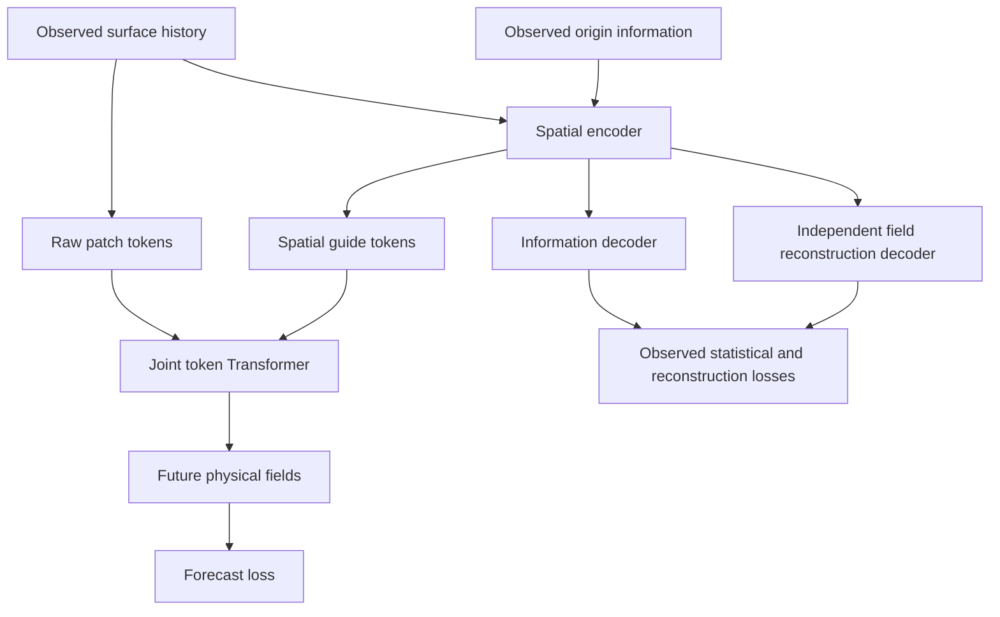

# Raw fields with a learned statistical guide

This adds an optional forecasting route without replacing the existing raw or
E → predictor → D experiments. The encoder learns statistical constraints from
observed reconstruction; its spatial latent features accompany raw observations
as Transformer tokens. The Transformer predicts physical fields directly. A
forecast manifold decoder is not used in this route.



Forecast and information routes train together. In learned-guide mode both
forecast and information losses update E. In zero-guide mode only the observed
information route updates E; the Transformer receives zero guide values. The
same token layout, guide input module and Transformer are retained for this
ablation, so it is not equivalent to deleting the guide branch.

“Statistical guide” is intentional: this encoder is deterministic. W2, KL/entropy
or signed-measure supervision does not introduce latent sampling, a VAE posterior
or a calibrated stochastic ensemble. Previously deferred statistical-flow and
conditional-flow objectives remain off in the provided runner.

## Paths and controls

| `--bridge` | Forecast path | Forecast manifold decoder | Extra observed supervision |
| --- | --- | --- | --- |
| `raw` | raw fields → Transformer → fields | none | none |
| `latent` | E → Transformer → D_forecast | used | reconstruction/statistical constraints |
| `guided` | raw fields + E(history) → Transformer → fields | unused/frozen | reconstruction/statistical constraints |

All three arms use `--model transformer`, fresh initialization, joint training,
spatial representations, the same data splits, observation availability,
history/lead windows and per-seed training settings. Width, depth, patch size and
attention heads match. Total parameter counts do **not** match: representations,
decoders and token projections change across routes. Raw-versus-guided is a
whole-model comparison; it alone does not isolate the effect of the statistical
loss. The checkpoint and evaluation report disclose total/trainable/forecast/
constraint parameter counts.

The guide receives the observed surface history and **origin-time extra
information broadcast across that history**, as in the existing bridge. It does
not receive future fields or future information at inference. This is not a claim
that extra information has been aligned to every historical time step. Guided
mode rejects `--no-information-conditioning`: origin information is part of the
guide encoder input and cannot be silently disabled through a raw-only switch.
All constraint targets are the observed pair origin−6 h and origin.

## Constraint scope

The opt-in `--constraint-pair statistical` enables statistical constraints alone;
existing two-group PINN/statistical/static options remain supported. Pointwise
observed reconstruction remains active as a separate information-preservation
term. PINN and static penalties are zero in this experiment.

The default `--constraint-decoder separate_surface_and_information` uses an
independent surface reconstruction decoder plus the information decoder. This
includes the surface sea-level-pressure, temperature and wind channels in the
statistical supervision, and the available dynamic sidecar variables. The
forecast decoder is not used for reconstruction constraints.

With `--constraint-decoder information_only`, only the sidecar's selected dynamic
information variables receive these losses. Sea-level pressure is **not**
supervised by that branch if the sidecar does not include it. Static information
may still be available as input context; disabling the static *loss* does not
remove static input features.

Loss selection:

- `w2`: area-weighted spatial value marginal/quantile matching. It does not preserve
  the geographical placement of high/low pressure by itself.
- `kl_entropy`: KL(observed || reconstructed), using shared differentiable soft
  histogram bins. This is not the VAE latent-prior KL.
- `signed_measure`: positive/negative spatial mass matching and total-mass terms,
  using zero in normalized coordinates, **not zero pascals**. This retains
  geographic support in its statistical comparison.

`--spatial-variable-conditioning` optionally uses variable-specific encoders,
feature fusion and variable-specific surface decoders. This optional pathway was
reconstructed from the documented earlier design after its unpublished working
copy was unavailable; it is not a claim that the exact lost implementation was
recovered. Without the flag, the standard spatial encoder remains the default.

## Reproducible comparison

From the repository root, with the environment dependencies already installed:

```bash
export ARCHIVE=/absolute/path/to/surface_archive.npz
export INFO=/absolute/path/to/physical_information.npz
export RUN=/absolute/path/to/new_guided_transformer_run
DEVICE=cuda BATCH_SIZE=16 SEEDS="7 19 43" \
  VARIABLE_CONDITIONING=1 STATISTICAL_LOSS=signed_measure \
  bash scripts/run_guided_transformer_comparison.sh
```

This example enables the requested variable-specific encoders and spatial signed
measure objective. The runner defaults remain `VARIABLE_CONDITIONING=0` and
`STATISTICAL_LOSS=w2` when they are not specified.

This dispatches 9 fits (3 routes × 3 seeds), evaluates the validation split and
writes `comparison.json` plus physical per-variable/per-lead CSV tables. The
runner refuses to overwrite a run directory. Set `PYTHON` to your environment's
Python executable when needed.

To add the zero-guide ablation, set `INCLUDE_ZERO_GUIDE=1` (12 fits). To use the
variable-conditioned encoder, set `VARIABLE_CONDITIONING=1` consistently across
arms. Use a new `RUN` for a different `STATISTICAL_LOSS=kl_entropy` or
`STATISTICAL_LOSS=signed_measure`. Batch size defaults to 16.

For a small integration run, set `SEEDS=7 EPOCHS=1 MAX_WINDOWS=8 MAX_CASES=2`
with a new `RUN`; this is not evidence of forecasting skill. No full training is
started merely by adding these files.

Guided evaluation records `guide_contract` and may save `guide_history_latent`
in the forecast NPZ. Guided predictions have no `predicted_latent` rollout, so
latent trajectory diagnostics are intentionally absent. Field forecasts remain
evaluated using the same physical metrics and origins. Learned/zero guide runs
are kept in separate comparison arms and never pooled as random seeds of one
model. Statistical-only arms likewise remain distinct from the historical
three pairwise constraint groups.


## Encoder-constraint ablation and test environment

The comparison tool also accepts a separately trained guided forecast-only arm:
keep the same `--bridge guided --guide-mode learned` architecture and common
training settings, use `--regularization none`, and omit `--constraint-pair` and
its statistical/decoder options. Compare its report with the constrained guided
report using `climate_manifold.downstream.compare`. The tool verifies zero
auxiliary objective weights, identical forecast parameter counts, guide mode,
input availability and training budget. It normalizes only the declared
constraint-route label. Its `add_observed_encoder_constraints` effect appears in
`guide_effects`; it is distinct from the zero-guide ablation.

This comparison measures the addition of observed reconstruction/statistical
supervision and its auxiliary decoders. It does not isolate statistical loss
from reconstruction loss, or assert equal total parameter counts. This extra
fit is not part of the default three-route runner.

The regression tests for this change used `xarray==2024.11.0`. The pre-existing
synthetic coarsening fixture fails with `xarray==2026.9.0`; use the validated
version when reproducing those tests. This is a test-fixture compatibility note,
not a claim that every real-data pipeline fails on newer xarray versions.
